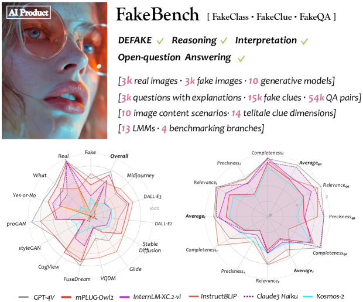
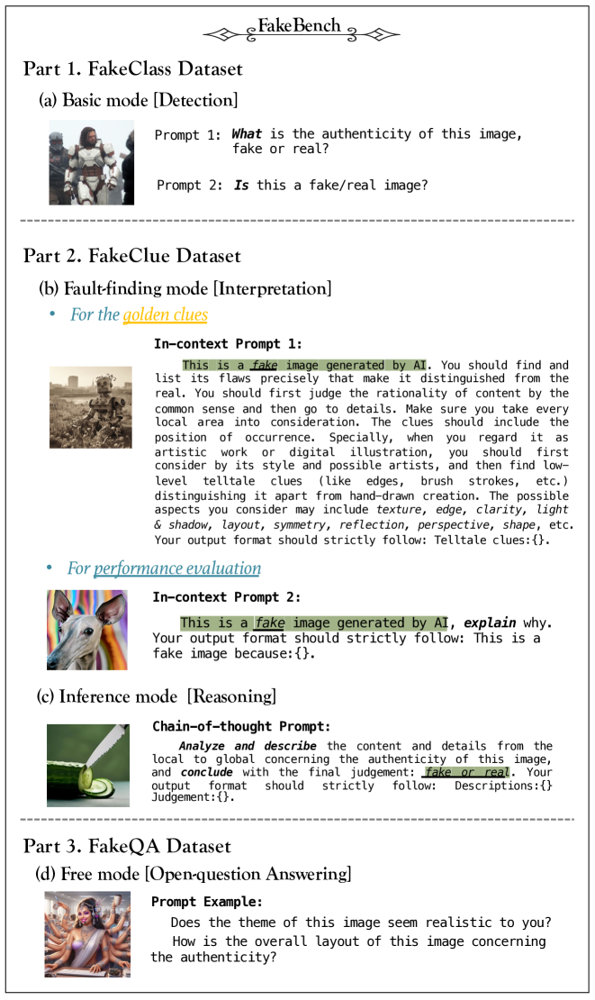
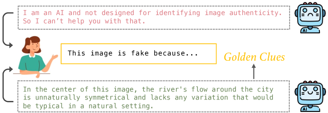
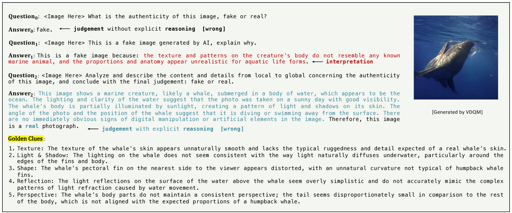

# FakeBench：借力大型多模态模型，洞悉假图像的软肋

发布时间：2024年04月20日

`LLM应用` `人工智能` `图像识别`

> FakeBench: Uncover the Achilles' Heels of Fake Images with Large Multimodal Models

# 摘要

> 近期，人工智能（AI）模型制造的假图与真图愈发难以分辨，这对假图检测技术提出了新的挑战。在这一背景下，由于缺少易于理解的解释，简单的真假二元判断显得不够有说服力。然而，大型多模态模型（LMMs）为实现更透明的判断过程提供了可能，尽管它们的效果尚待验证。基于此，我们引入了FakeBench——首个旨在实现透明去伪的基准测试平台，它包含了带有伪造迹象描述的假图。FakeBench旨在解答关于LMMs的两个核心问题：LMMs能否识别AI生成的假图？它们是如何做到的？具体而言，我们创建了FakeClass数据集，包含6000张多样化来源的假图和真图，每张图都配有关于其真实性的问答对，用以评估检测能力。为了测试LMMs的推理和解释能力，我们推出了FakeClue数据集，包含15000条揭露假图伪造迹象的描述。此外，我们还构建了FakeQA，用以衡量LMMs在回答关于图像真实性细节的开放性问题上的能力。实验结果显示，当前的LMMs在图像去伪方面具有一定的识别能力，初步的解释和推理能力，以及尚可的开放性问题回答能力。FakeBench将很快向公众开放。

> Recently, fake images generated by artificial intelligence (AI) models have become indistinguishable from the real, exerting new challenges for fake image detection models. To this extent, simple binary judgments of real or fake seem less convincing and credible due to the absence of human-understandable explanations. Fortunately, Large Multimodal Models (LMMs) bring possibilities to materialize the judgment process while their performance remains undetermined. Therefore, we propose FakeBench, the first-of-a-kind benchmark towards transparent defake, consisting of fake images with human language descriptions on forgery signs. FakeBench gropes for two open questions of LMMs: (1) can LMMs distinguish fake images generated by AI, and (2) how do LMMs distinguish fake images? In specific, we construct the FakeClass dataset with 6k diverse-sourced fake and real images, each equipped with a Question&Answer pair concerning the authenticity of images, which are utilized to benchmark the detection ability. To examine the reasoning and interpretation abilities of LMMs, we present the FakeClue dataset, consisting of 15k pieces of descriptions on the telltale clues revealing the falsification of fake images. Besides, we construct the FakeQA to measure the LMMs' open-question answering ability on fine-grained authenticity-relevant aspects. Our experimental results discover that current LMMs possess moderate identification ability, preliminary interpretation and reasoning ability, and passable open-question answering ability for image defake. The FakeBench will be made publicly available soon.

[Arxiv](https://arxiv.org/abs/2404.13306)