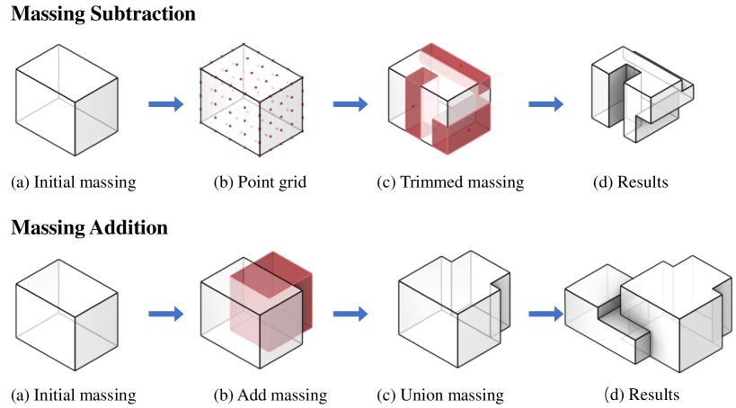
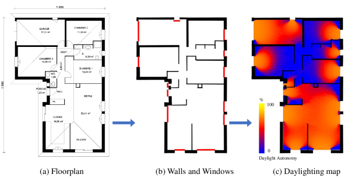

# 利用扩散模型打造日光驱动的建筑设计理念。

发布时间：2024年04月20日

`分类：LLM应用

这篇论文介绍了一种结合了大规模语言模型和文本到图像模型的人工智能辅助建筑设计方法。这种方法通过快速生成建筑体量模型、精确规划窗户布局，并提升视觉建筑设计渲染图的生成效率，为建筑设计领域提供了新的创新路径。这表明了大规模语言模型在实际应用中的潜力，特别是在跨学科研究领域，如建筑设计。因此，这篇论文应归类为LLM应用。` `人工智能`

> Generating Daylight-driven Architectural Design via Diffusion Models

# 摘要

> 近年来，随着大规模模型技术的迅猛发展，为建筑等跨学科研究领域开辟了诸多新路径。本文介绍了一种创新的、以日光为导向的人工智能辅助建筑设计方法。我们首先设计了一种快速生成建筑体量模型的方法，利用随机参数迅速构建模型。接着，我们引入了一种以日光为驱动的立面设计策略，精确规划窗户布局，并将其整合到体量模型中。最终，我们巧妙地将大规模语言模型与文本到图像模型相结合，极大提升了视觉建筑设计渲染图的生成效率。实验结果显示，该方法不仅激发了建筑师的创意灵感，还为建筑设计的创新之路提供了新的起点。项目详情可访问：https://zrealli.github.io/DDADesign/。

> In recent years, the rapid development of large-scale models has made new possibilities for interdisciplinary fields such as architecture. In this paper, we present a novel daylight-driven AI-aided architectural design method. Firstly, we formulate a method for generating massing models, producing architectural massing models using random parameters quickly. Subsequently, we integrate a daylight-driven facade design strategy, accurately determining window layouts and applying them to the massing models. Finally, we seamlessly combine a large-scale language model with a text-to-image model, enhancing the efficiency of generating visual architectural design renderings. Experimental results demonstrate that our approach supports architects' creative inspirations and pioneers novel avenues for architectural design development. Project page: https://zrealli.github.io/DDADesign/.

[Arxiv](https://arxiv.org/abs/2404.13353)