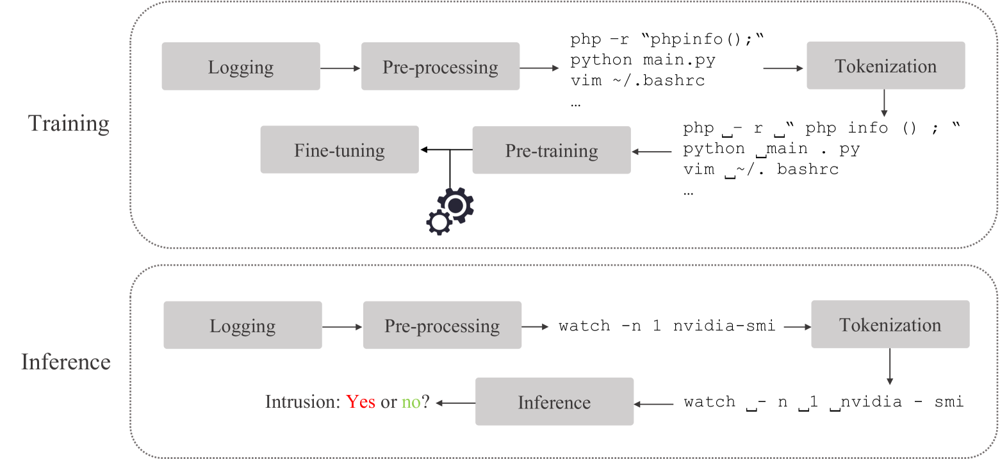
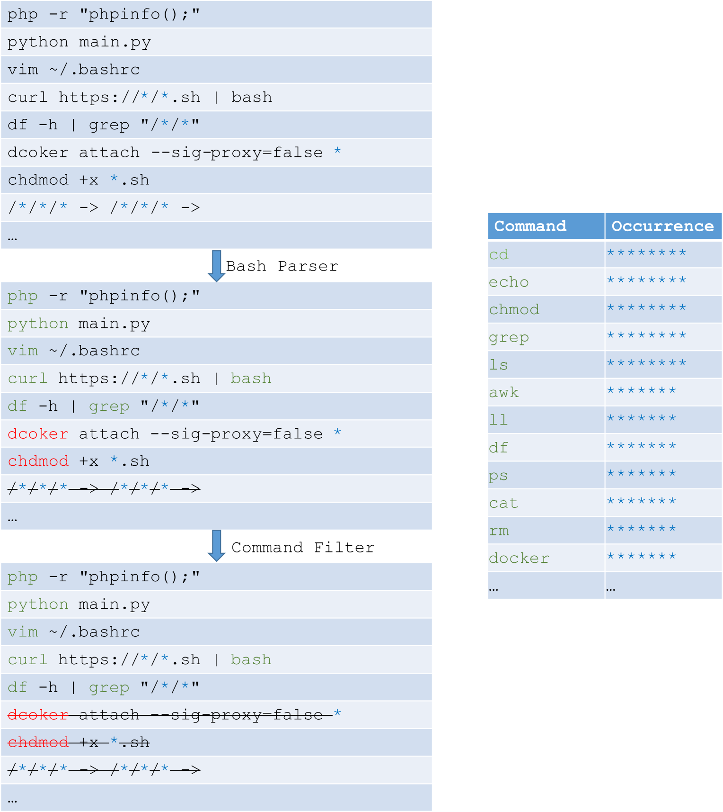

# 借助命令行语言模型的力量，实现大规模的入侵检测。

发布时间：2024年04月20日

`分类：Agent` `网络安全` `机器学习`

> Intrusion Detection at Scale with the Assistance of a Command-line Language Model

# 摘要

> 入侵检测一直是网络安全领域的核心议题，自动检测入侵的系统备受企业安全解决方案的青睐。现行的安全解决方案多依赖于安全专家制定的手工规则，这些规则不仅误报率高，而且对于新型的零日攻击在大规模情况下的防御能力有限。AI和机器学习技术通过智能分析数据中的异常用户行为，为这一问题提供了新的解决途径。尽管如此，目前文献中记录的基于学习机制的入侵检测系统大多针对小规模数据，未能充分发挥大数据在云环境中的潜力。本文针对这一挑战，提出了一个结合了大规模预训练的入侵检测系统，该系统利用数千万条命令行数据训练大型语言模型，以实现基于AI的入侵检测。通过在3000万训练样本和1000万测试样本上的实验，我们验证了该解决方案的有效性。

> Intrusion detection is a long standing and crucial problem in security. A system capable of detecting intrusions automatically is on great demand in enterprise security solutions. Existing solutions rely heavily on hand-crafted rules designed by security operators, which suffer from high false negative rates and poor generalization ability to new, zero-day attacks at scale. AI and machine learning offer promising solutions to address the issues, by inspecting abnormal user behaviors intelligently and automatically from data. However, existing learning-based intrusion detection systems in the literature are mostly designed for small data, and they lack the ability to leverage the power of big data in cloud environments. In this paper, we target at this problem and introduce an intrusion detection system which incorporates large-scale pre-training, so as to train a large language model based on tens of millions of command lines for AI-based intrusion detection. Experiments performed on 30 million training samples and 10 million test samples verify the effectiveness of our solution.

[Arxiv](https://arxiv.org/abs/2404.13402)