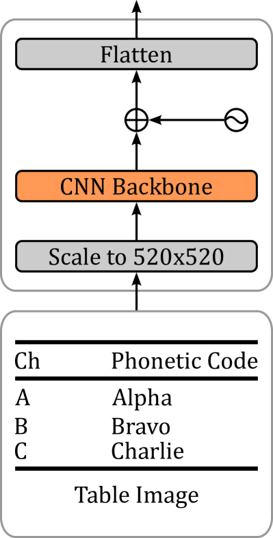

# 采用多单元解码器结合互学习技术，以提高表格结构识别和字符识别的准确性。

发布时间：2024年04月20日

`分类：LLM应用

这篇论文讨论了如何将文档中的表格内容提取并转换成大型语言模型处理的格式，这是一个实际应用问题，涉及到了大型语言模型（LLM）在知识信息处理方面的应用。论文提出了一种端到端的处理方法，并通过实验验证了其有效性。因此，这篇论文应该归类为LLM应用。` `文档处理`

> Multi-Cell Decoder and Mutual Learning for Table Structure and Character Recognition

# 摘要

> 将科学论文和财务报告等文档中的表格内容提取并转换成大型语言模型处理的格式，对于知识信息处理至关重要。采用端到端策略，不仅识别表格结构，还包括单元格内容，其性能已达到与外部字符识别系统的最新模型相仿的水平，且有望进一步提升。这些模型通过引入局部注意力机制，现在能够识别拥有数百个单元格的长表格。不过，它们仅在一个方向上识别表格结构，即从标题至页脚，且对每个单元格的内容识别是独立进行的，这限制了从相邻单元格中提取有用信息的可能性。本文提出了一种多单元格内容解码器和双向互学习机制，以优化端到端的处理方法。我们在两个大型数据集上验证了其有效性，实验结果显示，即便是面对含有大量单元格的长表格，该方法的性能也能与业界顶尖模型相提并论。

> Extracting table contents from documents such as scientific papers and financial reports and converting them into a format that can be processed by large language models is an important task in knowledge information processing. End-to-end approaches, which recognize not only table structure but also cell contents, achieved performance comparable to state-of-the-art models using external character recognition systems, and have potential for further improvements. In addition, these models can now recognize long tables with hundreds of cells by introducing local attention. However, the models recognize table structure in one direction from the header to the footer, and cell content recognition is performed independently for each cell, so there is no opportunity to retrieve useful information from the neighbor cells. In this paper, we propose a multi-cell content decoder and bidirectional mutual learning mechanism to improve the end-to-end approach. The effectiveness is demonstrated on two large datasets, and the experimental results show comparable performance to state-of-the-art models, even for long tables with large numbers of cells.

[Arxiv](https://arxiv.org/abs/2404.13268)