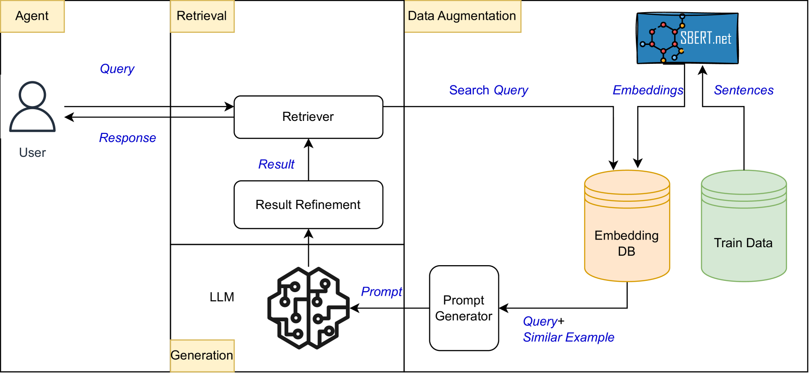
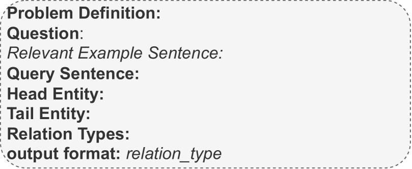
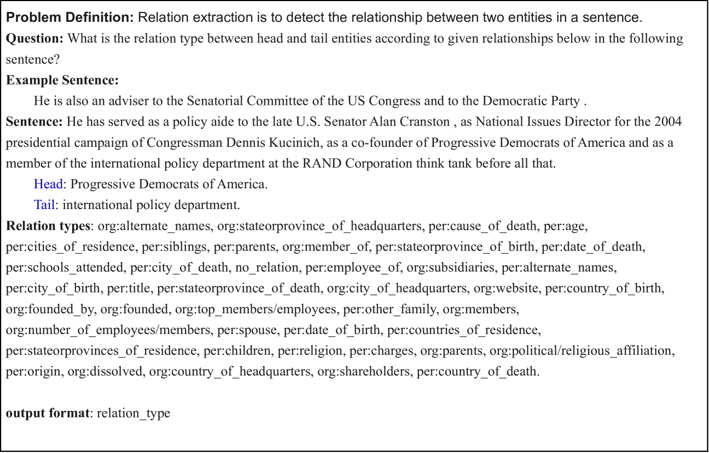
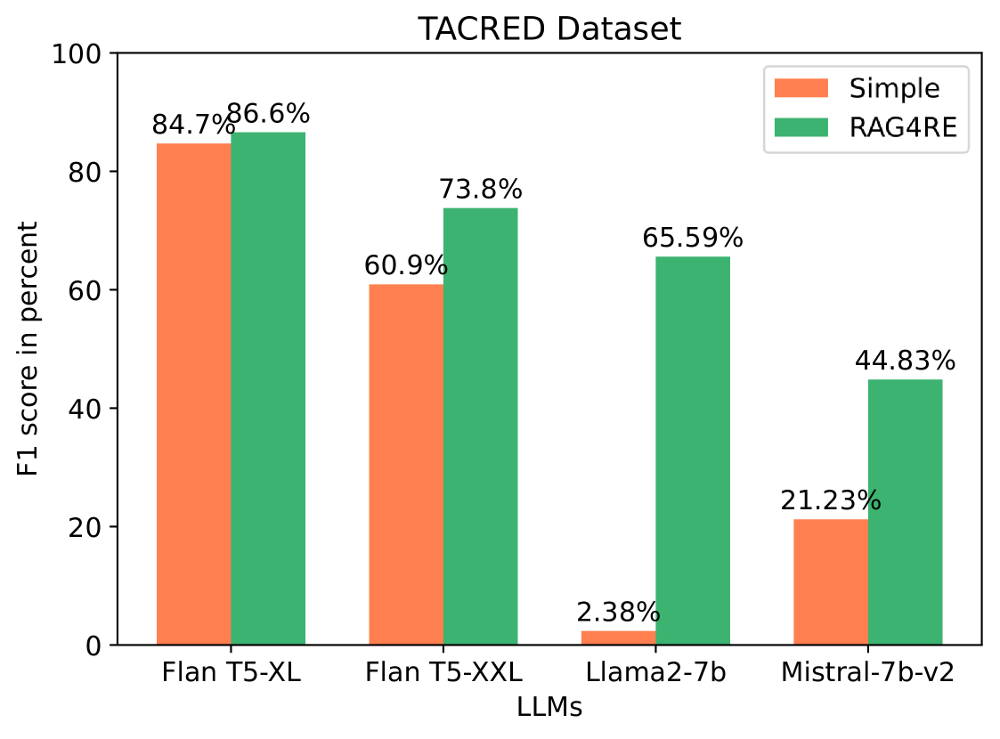
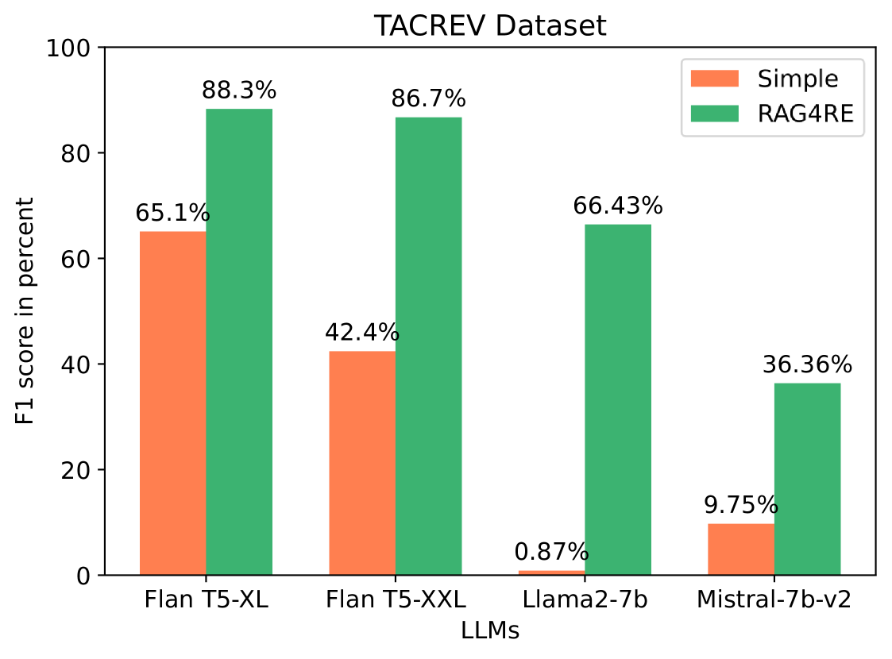
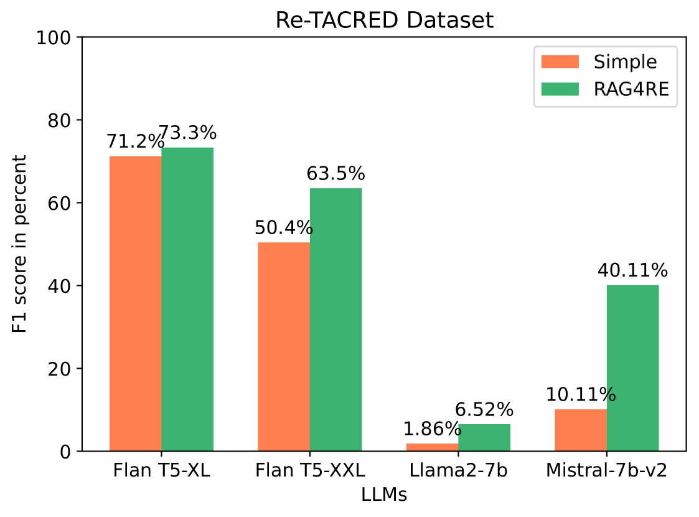
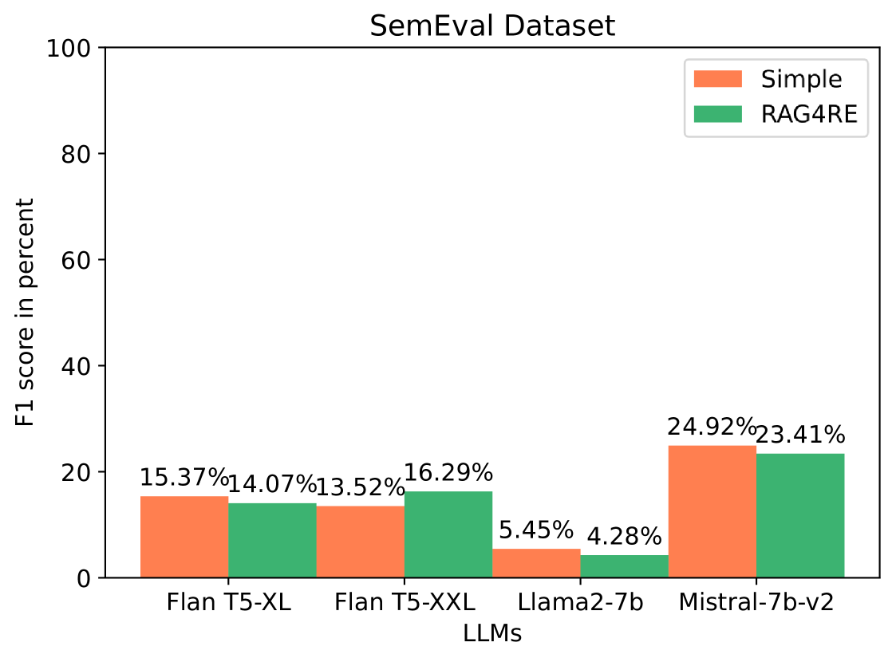
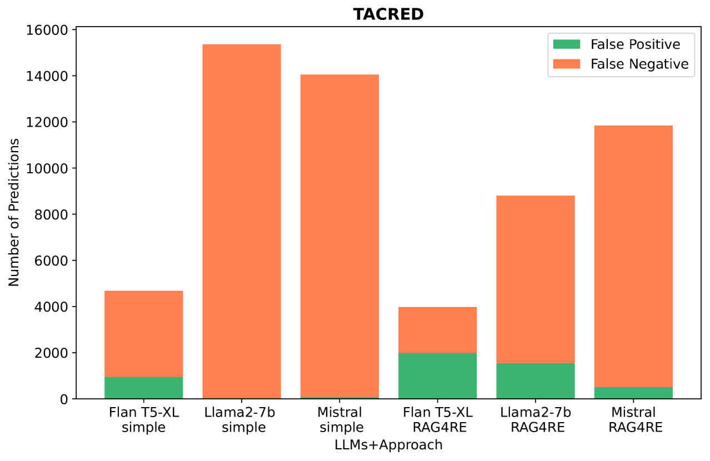
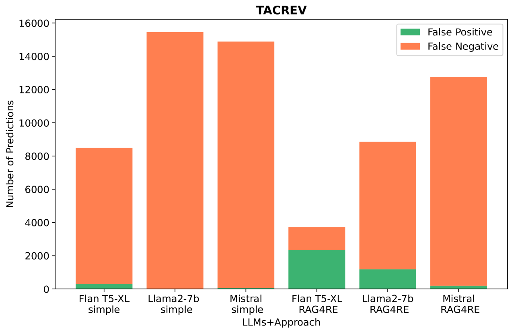
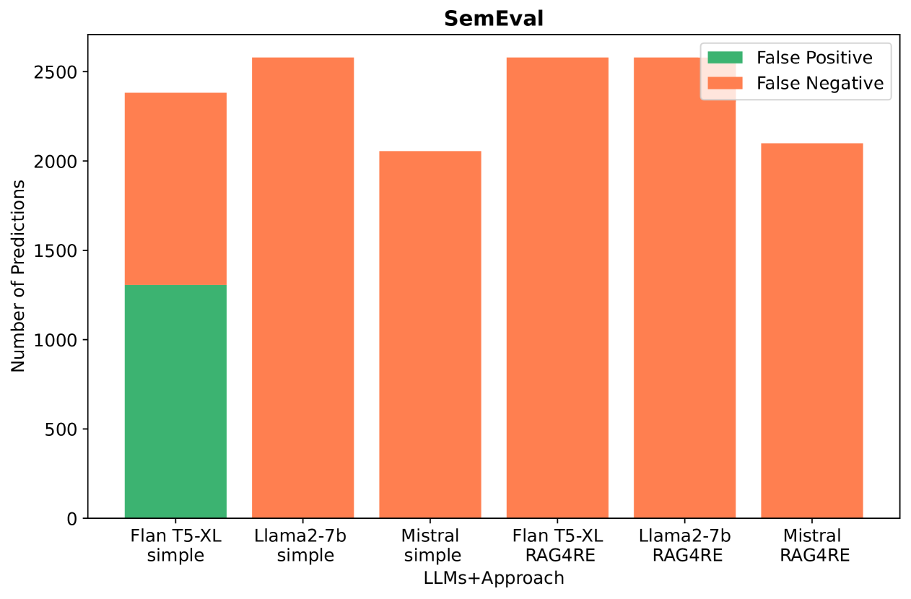

# 检索增强型生成关系抽取

发布时间：2024年04月20日

`LLM应用` `信息抽取`

> Retrieval-Augmented Generation-based Relation Extraction

# 摘要

> 信息抽取（IE）通过实体和关系抽取（RE）技术，将杂乱无章的文本数据转化为有序格式，其中实体间关系的辨识尤为关键。尽管众多关系抽取技术存在，但其成功与否往往受限于标记数据的可用性和计算资源的充足性。为解决这些问题，大型语言模型（LLMs）提供了一种充满希望的解决方案，尽管它们有时可能因训练数据而产生误导性回应。本文提出的检索增强生成关系抽取（RAG4RE）方法，旨在提升关系抽取任务的效率。我们通过多种大型语言模型（LLMs），如Flan T5、Llama2和Mistral，对RAG4RE方法的有效性进行了评估，并选取了TACRED、TACREV、Re-TACRED和SemEval RE等权威基准进行测试。研究结果显示，RAG4RE在TACRED数据集及其衍生版本中的表现尤为突出，超越了仅依赖LLMs的传统关系抽取方法。此外，与TACRED和TACREV数据集上的先前方法相比，RAG4RE同样展现了卓越的性能，彰显了其在自然语言处理领域关系抽取任务中的潜力和效果。

> Information Extraction (IE) is a transformative process that converts unstructured text data into a structured format by employing entity and relation extraction (RE) methodologies. The identification of the relation between a pair of entities plays a crucial role within this framework. Despite the existence of various techniques for relation extraction, their efficacy heavily relies on access to labeled data and substantial computational resources. In addressing these challenges, Large Language Models (LLMs) emerge as promising solutions; however, they might return hallucinating responses due to their own training data. To overcome these limitations, Retrieved-Augmented Generation-based Relation Extraction (RAG4RE) in this work is proposed, offering a pathway to enhance the performance of relation extraction tasks.
  This work evaluated the effectiveness of our RAG4RE approach utilizing different LLMs. Through the utilization of established benchmarks, such as TACRED, TACREV, Re-TACRED, and SemEval RE datasets, our aim is to comprehensively evaluate the efficacy of our RAG4RE approach. In particularly, we leverage prominent LLMs including Flan T5, Llama2, and Mistral in our investigation. The results of our study demonstrate that our RAG4RE approach surpasses performance of traditional RE approaches based solely on LLMs, particularly evident in the TACRED dataset and its variations. Furthermore, our approach exhibits remarkable performance compared to previous RE methodologies across both TACRED and TACREV datasets, underscoring its efficacy and potential for advancing RE tasks in natural language processing.

[Arxiv](https://arxiv.org/abs/2404.13397)