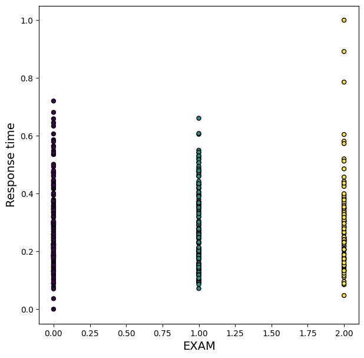
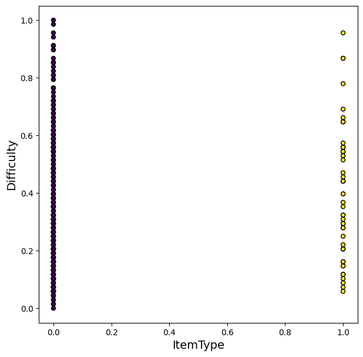
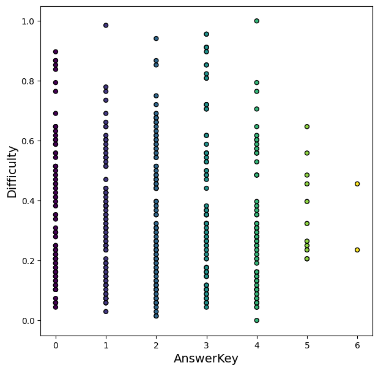

# UnibucLLM：发挥大型语言模型的潜力，实现对多项选择题难度及答题时间的自动预测。

发布时间：2024年04月20日

`LLM应用` `医学考试` `自动化评估`

> UnibucLLM: Harnessing LLMs for Automated Prediction of Item Difficulty and Response Time for Multiple-Choice Questions

# 摘要

> 本项研究创新性地采用大型语言模型（LLMs）进行数据增强，旨在预测美国医学执照考试（USMLE）中已退役的多项选择题（MCQs）在 BEA 2024 共享任务的题目难度与答题时间。我们的方法融合了零射击 LLMs（Falcon、Meditron、Mistral）提供的答案，并通过六种不同的特征组合，运用基于变换器的模型进行分析。研究发现，准确预测题目难度较为困难，但我们的最佳方法均有效利用了问题文本，并从 LLMs 答案的多样性中获益，这突显了 LLMs 在提升医学执照考试自动化评估中的应用前景。我们的代码已在 https://github.com/ana-rogoz/BEA-2024 上公开，以供参考。

> This work explores a novel data augmentation method based on Large Language Models (LLMs) for predicting item difficulty and response time of retired USMLE Multiple-Choice Questions (MCQs) in the BEA 2024 Shared Task. Our approach is based on augmenting the dataset with answers from zero-shot LLMs (Falcon, Meditron, Mistral) and employing transformer-based models based on six alternative feature combinations. The results suggest that predicting the difficulty of questions is more challenging. Notably, our top performing methods consistently include the question text, and benefit from the variability of LLM answers, highlighting the potential of LLMs for improving automated assessment in medical licensing exams. We make our code available https://github.com/ana-rogoz/BEA-2024.

[Arxiv](https://arxiv.org/abs/2404.13343)