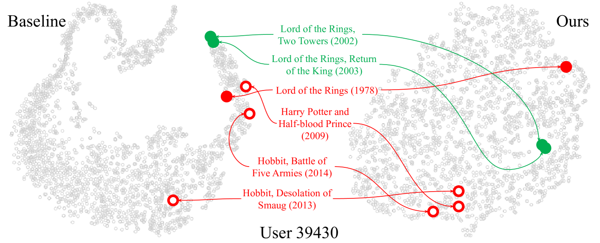

# 为冷启动内容推荐而设计的通用项目表示学习

发布时间：2024年04月21日

`分类：RAG

这篇论文提出了一种新颖的项目表示学习框架，用于解决推荐系统中的冷启动问题。它采用了基于 Transformer 的架构，实现了不同特征之间的自然多模态对齐。这种方法在捕捉用户细微偏好方面超越了现有的最先进方法，并且具有跨领域、大规模应用的普遍性。因此，这篇论文可以归类为 RAG（Retrieval-Augmented Generation），因为它涉及到生成模型和检索系统的结合，以提高推荐系统的准确性和效率。` `推荐系统` `机器学习`

> General Item Representation Learning for Cold-start Content Recommendations

# 摘要

> 冷启动项目推荐一直是推荐领域的难题。传统上，人们倾向于采用基于内容的方法，但往往未能充分利用原始内容中的丰富信息。本文提出了一种新颖的项目表示学习框架，旨在解决冷启动推荐问题。该框架采用基于 Transformer 的架构，实现了不同特征之间的自然多模态对齐。我们的模型无需依赖分类标签即可端到端训练，避免了收集成本高且不适宜推荐场景的标签依赖问题。通过在电影和新闻推荐的真实世界基准测试中进行的广泛实验，我们证实了该方法在捕捉用户细微偏好方面超越了现有的最先进方法，并且具有跨领域、大规模应用的普遍性。

> Cold-start item recommendation is a long-standing challenge in recommendation systems. A common remedy is to use a content-based approach, but rich information from raw contents in various forms has not been fully utilized. In this paper, we propose a domain/data-agnostic item representation learning framework for cold-start recommendations, naturally equipped with multimodal alignment among various features by adopting a Transformer-based architecture. Our proposed model is end-to-end trainable completely free from classification labels, not just costly to collect but suboptimal for recommendation-purpose representation learning. From extensive experiments on real-world movie and news recommendation benchmarks, we verify that our approach better preserves fine-grained user taste than state-of-the-art baselines, universally applicable to multiple domains at large scale.

[Arxiv](https://arxiv.org/abs/2404.13808)