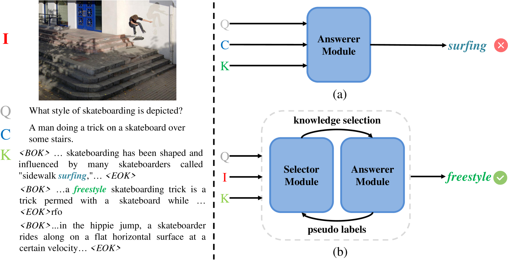
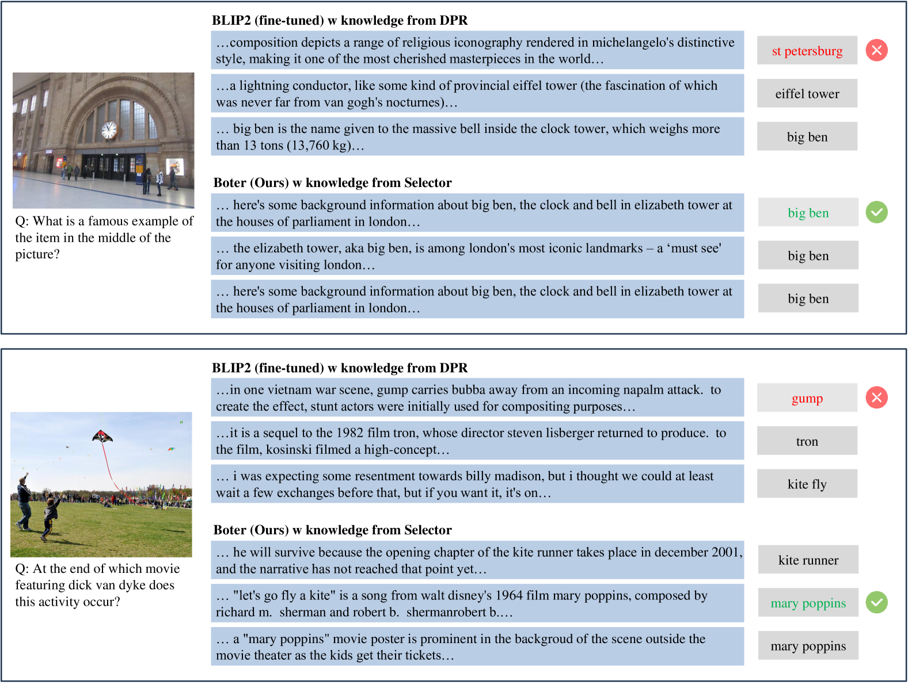

# Boter：一种自举技术，旨在提升基于知识的 VQA（视觉问答）领域中的知识选择和自动问答能力。

发布时间：2024年04月22日

`分类：LLM应用

这篇论文讨论了知识驱动的可视化问答系统，它利用多模态大型语言模型（MLLM）来优化知识选择和问答过程。这个系统通过选择器和回答器两个模块来实现，这两个模块都由MLLM初始化并经过高效微调。这篇论文的重点是实际应用，即如何使用大型语言模型来提高知识驱动的可视化问答系统的性能，因此它属于LLM应用类别。` `可视化问答` `人工智能`

> Boter: Bootstrapping Knowledge Selection and Question Answering for Knowledge-based VQA

# 摘要

> 知识驱动的可视化问答系统需整合外部知识以回答视觉内容相关问题。传统“检索后生成”方法虽表现不俗，但存在不足：一是仅基于查询与知识嵌入的相似性独立检索知识，忽略了知识文档对问题解答的实质性帮助；二是将图像信息转换为文本后进行检索和回答，可能无法全面捕捉图像信息。为克服这些限制，我们设计了Boter框架，它利用多模态大型语言模型（MLLM）的感知能力，优化知识选择和问答过程。框架包含选择器和回答器两个模块，均由MLLM初始化并经过高效微调：首先，选择器在检索到的文档中筛选关键知识，用以微调回答器预测答案；其次，根据回答器的预测结果和弱监督标签生成关键知识文档的伪标签，进而微调选择器以精选知识；如此循环。该框架在OK-VQA这一开放域知识驱动VQA基准测试中显著提升了性能，达到了62.83%的业界领先准确率。

> Knowledge-based Visual Question Answering (VQA) requires models to incorporate external knowledge to respond to questions about visual content. Previous methods mostly follow the "retrieve and generate" paradigm. Initially, they utilize a pre-trained retriever to fetch relevant knowledge documents, subsequently employing them to generate answers. While these methods have demonstrated commendable performance in the task, they possess limitations: (1) they employ an independent retriever to acquire knowledge solely based on the similarity between the query and knowledge embeddings, without assessing whether the knowledge document is truly conducive to helping answer the question; (2) they convert the image into text and then conduct retrieval and answering in natural language space, which may not ensure comprehensive acquisition of all image information. To address these limitations, we propose Boter, a novel framework designed to bootstrap knowledge selection and question answering by leveraging the robust multimodal perception capabilities of the Multimodal Large Language Model (MLLM). The framework consists of two modules: Selector and Answerer, where both are initialized by the MLLM and parameter-efficiently finetuned in a simple cycle: find key knowledge in the retrieved knowledge documents using the Selector, and then use them to finetune the Answerer to predict answers; obtain the pseudo-labels of key knowledge documents based on the predictions of the Answerer and weak supervision labels, and then finetune the Selector to select key knowledge; repeat. Our framework significantly enhances the performance of the baseline on the challenging open-domain Knowledge-based VQA benchmark, OK-VQA, achieving a state-of-the-art accuracy of 62.83%.

[Arxiv](https://arxiv.org/abs/2404.13947)