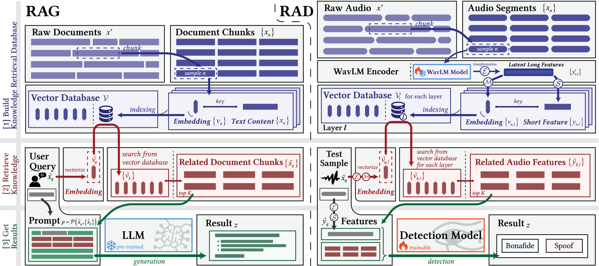
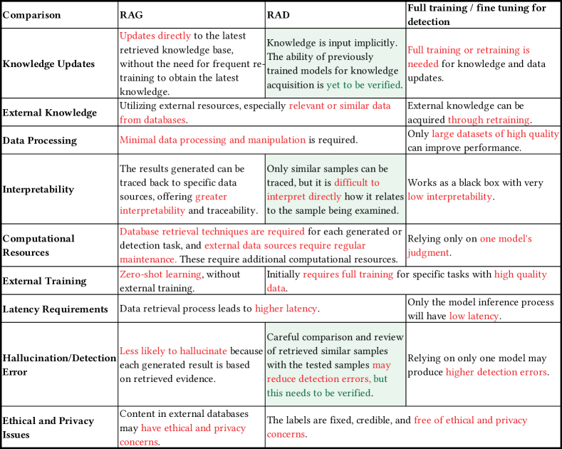
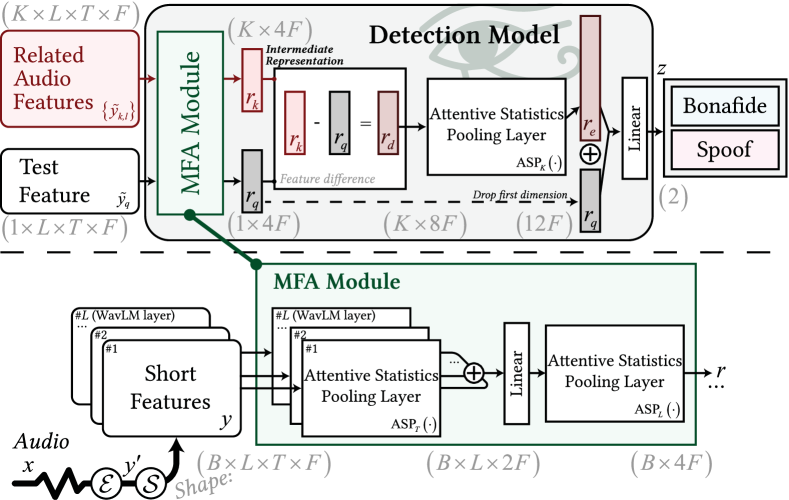

# 增强检索音频深度伪造检测

发布时间：2024年04月23日

`分类：LLM应用` `音频伪造检测`

> Retrieval-Augmented Audio Deepfake Detection

# 摘要

> 随着文本到语音和声音转换技术的进步，我们能够创造出极为逼真的音频深度伪造，这引发了对其可能被滥用的担忧。目前，大多数深度伪造检测方法主要依赖单一模型的模糊知识，这不仅限制了检测性能，也带来了透明度的挑战。借鉴检索增强生成的思路，我们提出了一种检索增强检测框架，通过引入相似的检索样本来增强测试样本的检测效果。此外，我们还对多融合注意力分类器进行了扩展，以适应我们的检测框架。大量实验证明，我们的框架在性能上超越了传统方法，在ASVspoof 2021深度伪造数据集上达到了最新水平，并在2019年和2021年的LA数据集上也展现了竞争力。深入分析样本后发现，检索器能够稳定地检索出与查询音频声学特征高度相似的同一说话人的样本，这显著提升了检测的准确性。

> With recent advances in speech synthesis including text-to-speech (TTS) and voice conversion (VC) systems enabling the generation of ultra-realistic audio deepfakes, there is growing concern about their potential misuse. However, most deepfake (DF) detection methods rely solely on the fuzzy knowledge learned by a single model, resulting in performance bottlenecks and transparency issues. Inspired by retrieval-augmented generation (RAG), we propose a retrieval-augmented detection (RAD) framework that augments test samples with similar retrieved samples for enhanced detection. We also extend the multi-fusion attentive classifier to integrate it with our proposed RAD framework. Extensive experiments show the superior performance of the proposed RAD framework over baseline methods, achieving state-of-the-art results on the ASVspoof 2021 DF set and competitive results on the 2019 and 2021 LA sets. Further sample analysis indicates that the retriever consistently retrieves samples mostly from the same speaker with acoustic characteristics highly consistent with the query audio, thereby improving detection performance.

[Arxiv](https://arxiv.org/abs/2404.13892)