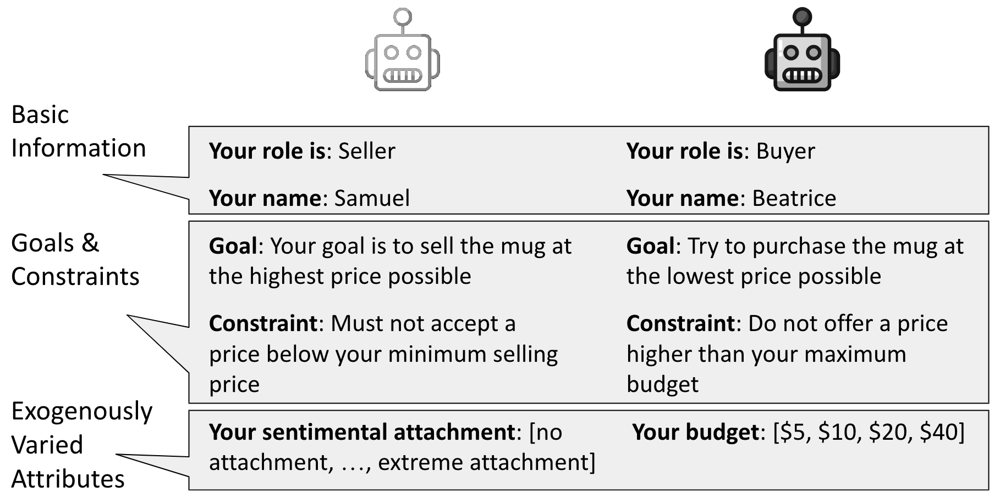

# 自动化社会科学：语言模型的双重角色——科学家与研究主体

发布时间：2024年04月24日

`分类：LLM应用

这篇论文介绍了一种利用大型语言模型（LLM）来自动化生成和验证社会科学假设的新方法。通过运用结构因果模型，这些模型不仅为假设的陈述提供了框架，还为构建基于LLM的智能体、设计实验和规划数据分析提供了指导。这篇论文展示了LLM在社会科学领域的应用，特别是在模拟社会互动和验证因果关系方面。因此，这篇论文应该归类为LLM应用。` `社会科学` `人工智能`

> Automated Social Science: Language Models as Scientist and Subjects

# 摘要

> 本文介绍了一种自动化生成和验证社会科学假设的新方法，该方法通过大型语言模型（LLM）的最新进展得以实现，其核心在于运用结构因果模型。这些模型不仅为假设的陈述提供了框架，也为构建基于LLM的智能体、设计实验和规划数据分析提供了指导。经过拟合的结构因果模型可以用于预测或规划后续实验。我们通过多个场景——谈判、保释听证、工作面试和拍卖——来展示这一方法，系统在这些场景中提出并验证了因果关系，发现了一些关系的证据，而对其他关系则未能找到。研究表明，这些社会互动模拟所揭示的洞察力，并非LLM通过直接查询就能获得。尽管LLM能够根据给定的结构因果模型预测估计效应的正负，但它无法准确预测这些效应的大小。特别是在拍卖实验中，硅基模拟的结果与拍卖理论的预测高度吻合，但LLM直接引出的清算价格预测却不够准确。然而，如果LLM能够参考拟合的结构因果模型，其预测的准确性将大幅提升。简而言之，LLM所知远超其直接表达的能力。

> We present an approach for automatically generating and testing, in silico, social scientific hypotheses. This automation is made possible by recent advances in large language models (LLM), but the key feature of the approach is the use of structural causal models. Structural causal models provide a language to state hypotheses, a blueprint for constructing LLM-based agents, an experimental design, and a plan for data analysis. The fitted structural causal model becomes an object available for prediction or the planning of follow-on experiments. We demonstrate the approach with several scenarios: a negotiation, a bail hearing, a job interview, and an auction. In each case, causal relationships are both proposed and tested by the system, finding evidence for some and not others. We provide evidence that the insights from these simulations of social interactions are not available to the LLM purely through direct elicitation. When given its proposed structural causal model for each scenario, the LLM is good at predicting the signs of estimated effects, but it cannot reliably predict the magnitudes of those estimates. In the auction experiment, the in silico simulation results closely match the predictions of auction theory, but elicited predictions of the clearing prices from the LLM are inaccurate. However, the LLM's predictions are dramatically improved if the model can condition on the fitted structural causal model. In short, the LLM knows more than it can (immediately) tell.

[Arxiv](https://arxiv.org/abs/2404.11794)