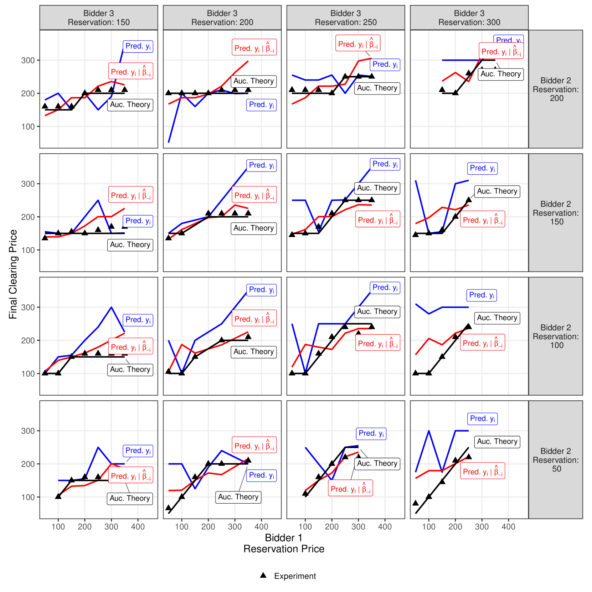
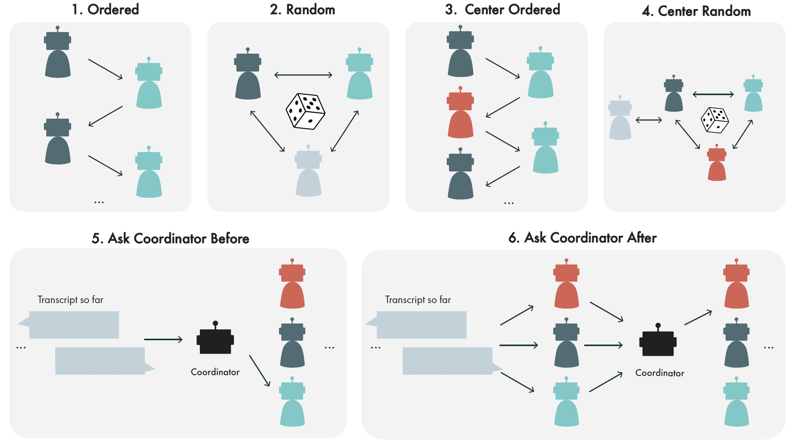
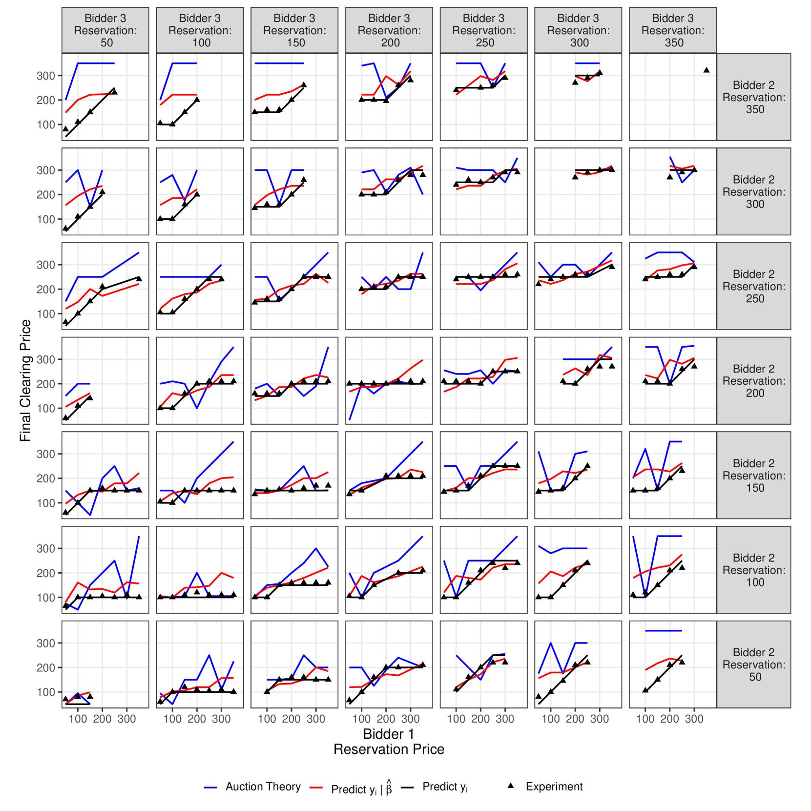

# 自动化社会科学：语言模型的双重角色——科学家与研究主体

发布时间：2024年04月24日

`分类：LLM应用

这篇论文讨论了如何利用大型语言模型（LLM）来生成和验证社会科学假说。它强调了结构因果模型在提出假说、构建基于LLM的智能体、设计实验和规划数据分析中的作用。通过在多个场景中展示这一方法，论文证明了LLM在社会互动模拟中的潜力。尽管LLM在直接询问时可能无法获得某些洞察，但通过拟合的结构因果模型，LLM能够更准确地预测估计效应的方向。因此，这篇论文属于LLM应用类别，因为它展示了如何将LLM应用于社会科学研究。` `社会科学` `自动化方法`

> Automated Social Science: Language Models as Scientist and Subjects

# 摘要

> 本研究介绍了一种自动化方法，用于在计算机模拟环境中生成并验证社会科学假说。这一进步依托于大型语言模型（LLM）的最新发展，关键在于采用了结构因果模型。这些模型不仅为提出假说提供了一种表述方式，也为构建基于LLM的智能体、设计实验和规划数据分析提供了指导。经过拟合的结构因果模型成为了预测或规划后续实验的有力工具。我们通过多个场景——谈判、保释听证、工作面试和拍卖——来展示这一方法。在这些场景中，系统能够提出并验证因果关系，为某些关系找到支持，而对其他关系则未能找到。研究显示，这些对社会互动模拟的洞察并非LLM通过直接询问就能获得的。在为每个场景提供其结构因果模型后，LLM能够准确预测估计效应的方向，但对效应大小的预测则不够可靠。特别是在拍卖实验中，模拟结果与拍卖理论的预测高度吻合，但LLM直接引出的清算价格预测却存在偏差。不过，如果LLM能够依据拟合的结构因果模型进行条件判断，其预测的准确性将大幅提升。简而言之，LLM的内在知识远超过其直接表达的能力。

> We present an approach for automatically generating and testing, in silico, social scientific hypotheses. This automation is made possible by recent advances in large language models (LLM), but the key feature of the approach is the use of structural causal models. Structural causal models provide a language to state hypotheses, a blueprint for constructing LLM-based agents, an experimental design, and a plan for data analysis. The fitted structural causal model becomes an object available for prediction or the planning of follow-on experiments. We demonstrate the approach with several scenarios: a negotiation, a bail hearing, a job interview, and an auction. In each case, causal relationships are both proposed and tested by the system, finding evidence for some and not others. We provide evidence that the insights from these simulations of social interactions are not available to the LLM purely through direct elicitation. When given its proposed structural causal model for each scenario, the LLM is good at predicting the signs of estimated effects, but it cannot reliably predict the magnitudes of those estimates. In the auction experiment, the in silico simulation results closely match the predictions of auction theory, but elicited predictions of the clearing prices from the LLM are inaccurate. However, the LLM's predictions are dramatically improved if the model can condition on the fitted structural causal model. In short, the LLM knows more than it can (immediately) tell.

[Arxiv](https://arxiv.org/abs/2404.11794)