# Cantor：激发机器学习大型语言模型的多模态思维链

发布时间：2024年04月24日

`分类：LLM应用

这篇论文讨论了如何通过结合视觉上下文获取与逻辑推理来解决复杂的视觉推理问题。它提出了一个创新的多模态CoT框架——Cantor，利用多模态大型语言模型（MLLMs）及其认知功能。这篇论文主要关注于如何应用大型语言模型来解决特定的问题，因此可以归类为LLM应用。` `视觉推理` `人工智能`

> Cantor: Inspiring Multimodal Chain-of-Thought of MLLM

# 摘要

> 随着引入了思维链（CoT）方法的大型语言模型（LLMs），视觉推理问题被细化为可操作的子任务，并借助多种外部工具逐步解决。但这种方法可能因视觉信息不足和低级感知工具的局限，导致决策时出现“确定性幻觉”。本文强调，结合视觉上下文获取与逻辑推理是攻克视觉推理难题的关键。本研究深入探讨了多模态CoT的应用，利用多模态大型语言模型（MLLMs）及其认知功能，来解决复杂的视觉推理问题。我们提出了一个创新的多模态CoT框架——Cantor，它采用感知-决策架构。Cantor作为一个决策生成器，整合视觉输入以分析图像和问题，确保更准确地捕捉实际上下文。同时，Cantor借助MLLMs的高级认知功能，充当多面专家，提炼出更高层次的信息，从而提升CoT生成过程。我们广泛的实验表明，Cantor框架在两个复杂的视觉推理数据集上显著提升了多模态CoT性能，且无需微调或依赖真实理由。项目页面：https://ggg0919.github.io/cantor/ 。

> With the advent of large language models(LLMs) enhanced by the chain-of-thought(CoT) methodology, visual reasoning problem is usually decomposed into manageable sub-tasks and tackled sequentially with various external tools. However, such a paradigm faces the challenge of the potential "determining hallucinations" in decision-making due to insufficient visual information and the limitation of low-level perception tools that fail to provide abstract summaries necessary for comprehensive reasoning. We argue that converging visual context acquisition and logical reasoning is pivotal for tackling visual reasoning tasks. This paper delves into the realm of multimodal CoT to solve intricate visual reasoning tasks with multimodal large language models(MLLMs) and their cognitive capability. To this end, we propose an innovative multimodal CoT framework, termed Cantor, characterized by a perception-decision architecture. Cantor first acts as a decision generator and integrates visual inputs to analyze the image and problem, ensuring a closer alignment with the actual context. Furthermore, Cantor leverages the advanced cognitive functions of MLLMs to perform as multifaceted experts for deriving higher-level information, enhancing the CoT generation process. Our extensive experiments demonstrate the efficacy of the proposed framework, showing significant improvements in multimodal CoT performance across two complex visual reasoning datasets, without necessitating fine-tuning or ground-truth rationales. Project Page: https://ggg0919.github.io/cantor/ .

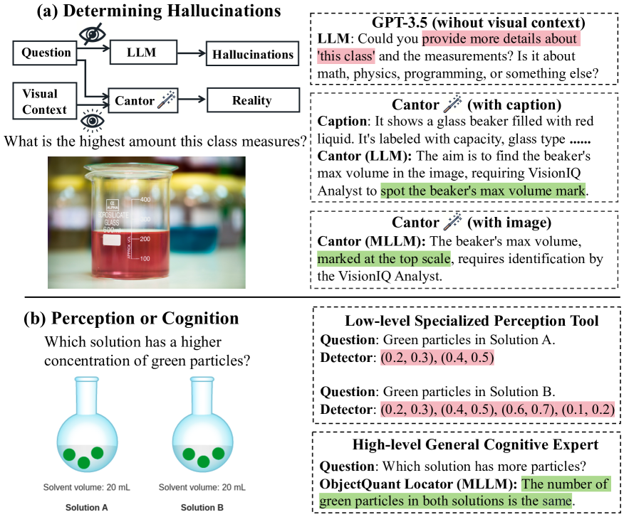

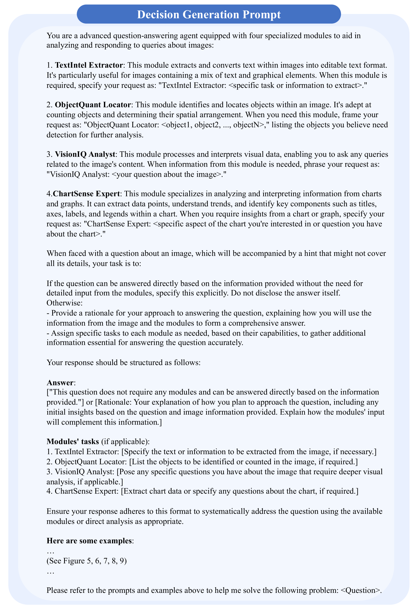

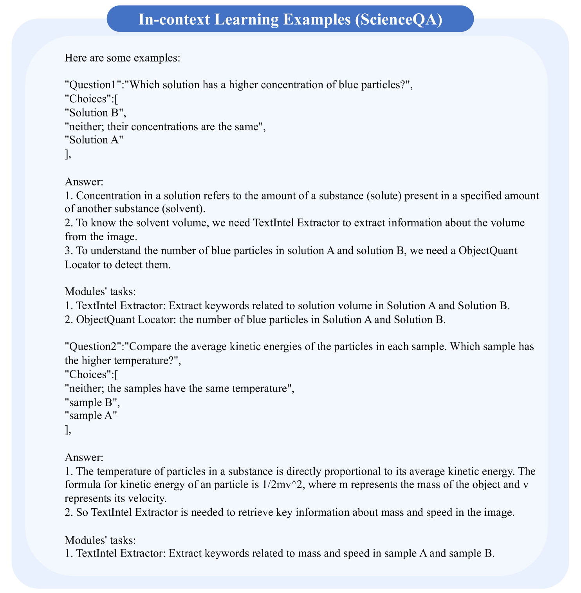

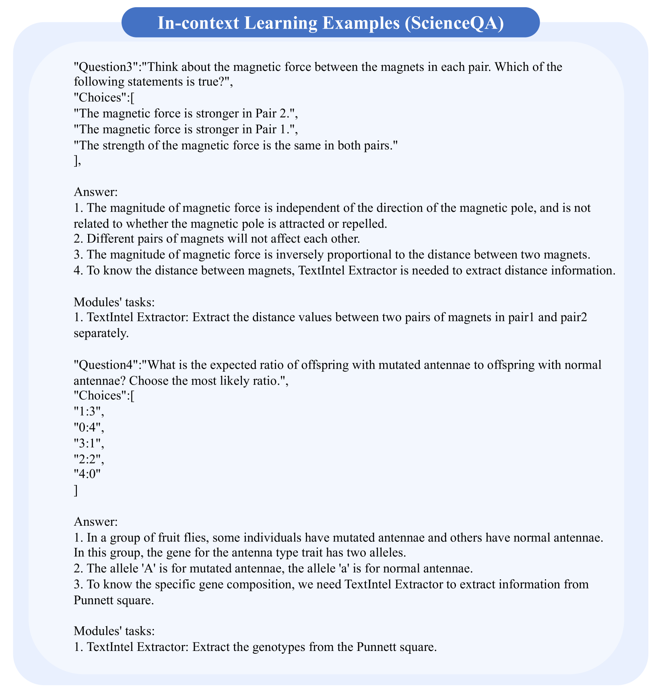

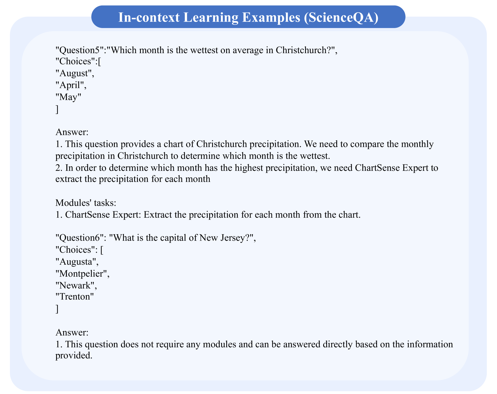

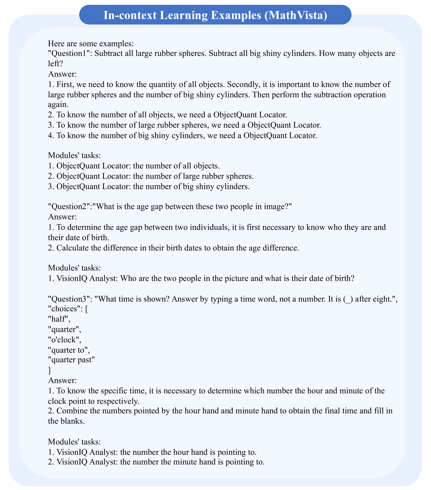

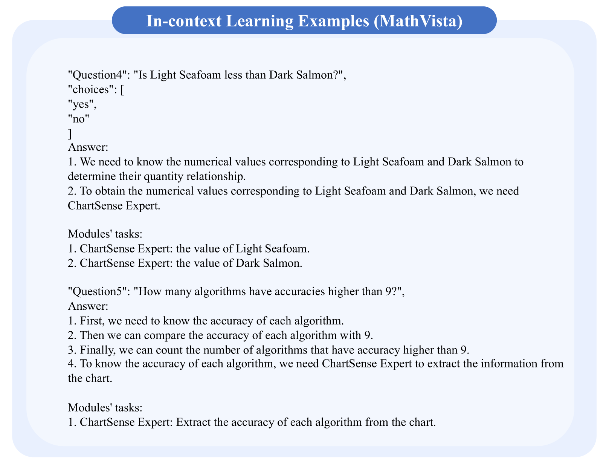

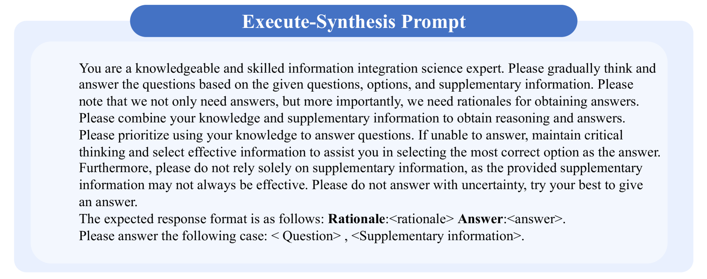

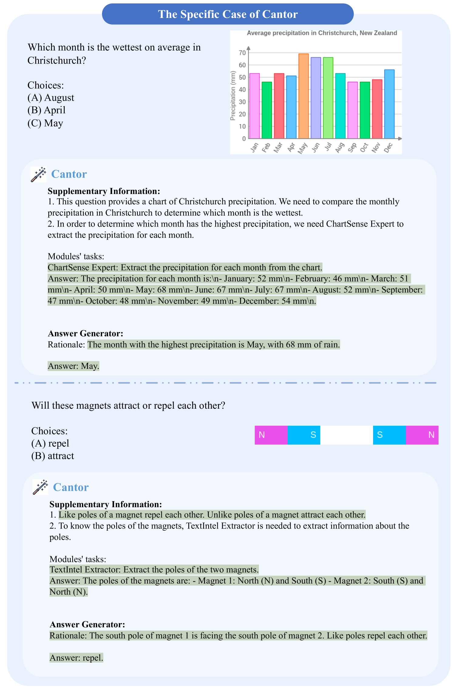

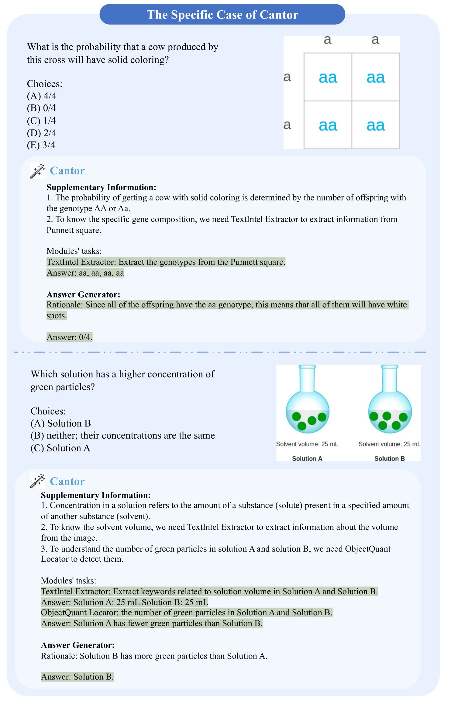

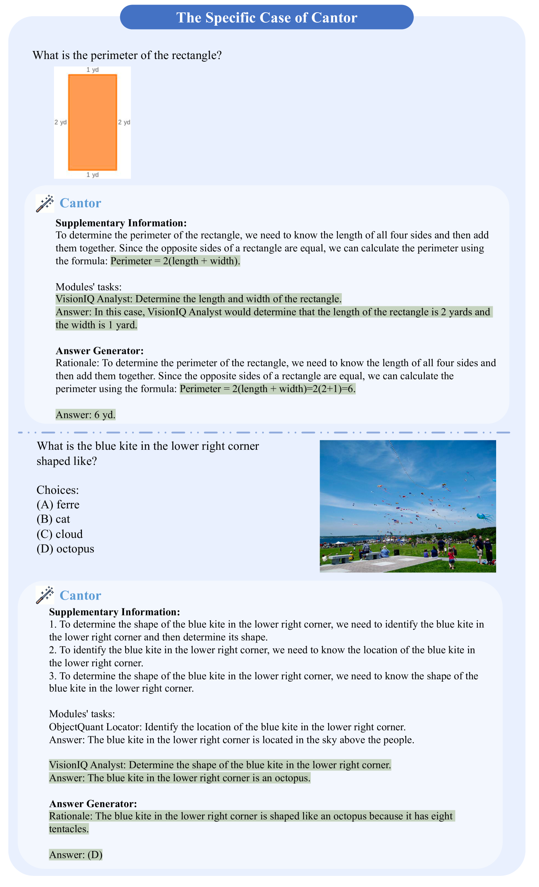

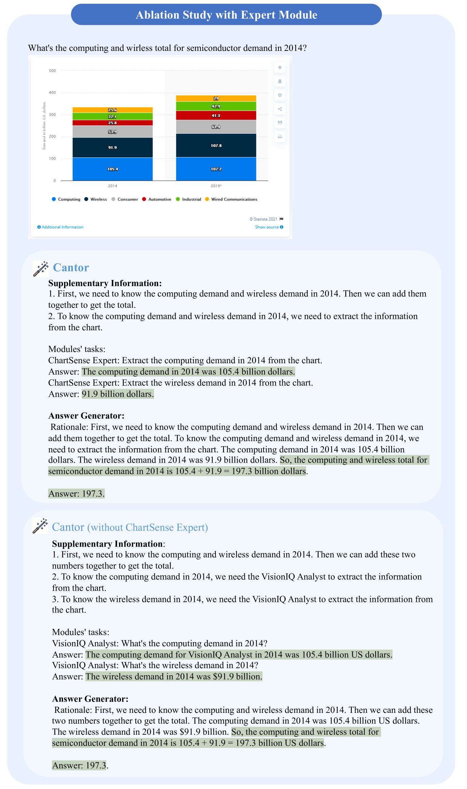

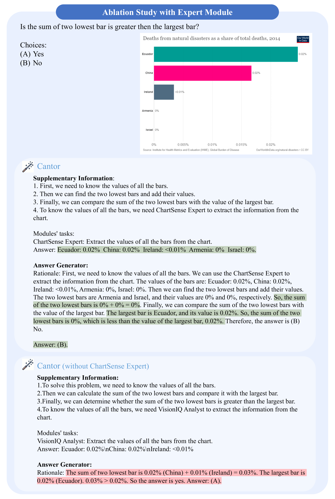

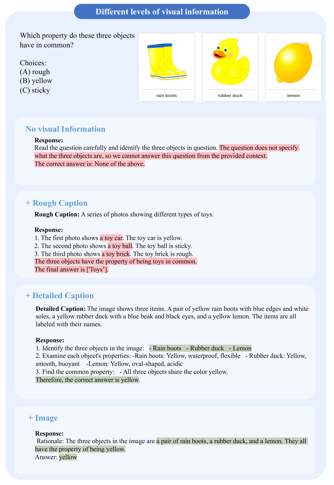

[Arxiv](https://arxiv.org/abs/2404.16033)