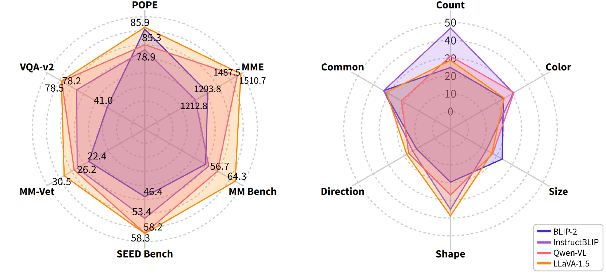
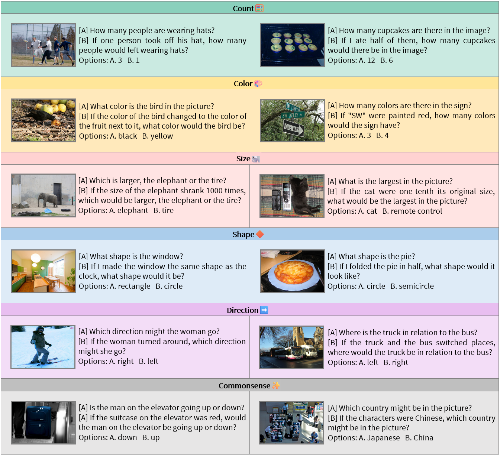

# 眼睛或有误导之嫌：对多模态大型语言模型的反事实推理能力进行评估。

发布时间：2024年04月24日

`LLM应用` `人工智能` `视觉问答`

> Eyes Can Deceive: Benchmarking Counterfactual Reasoning Abilities of Multi-modal Large Language Models

# 摘要

> 反事实推理是人类智慧的关键体现，它涉及基于确凿事实提出假设并推测可能的结果。当前的多模态大型语言模型（MLLMs）在视觉问答（VQA）的多项基准测试中已证实了其卓越的认知与推理技能。但当这些模型遭遇反事实询问时，它们的表现又会如何？为解答这一问题，我们首次构建了一个名为CFMM的反事实多模态推理基准测试，旨在全面评估MLLMs的反事实推理能力。CFMM包含六项挑战性任务，涵盖了数百个精心设计的人工标注反事实问题，用以多角度评价MLLMs的推理技能。实验结果显示，现有的MLLMs倾向于信赖直观所见，而忽视了问题中提出的反事实前提，这导致它们给出了不准确的答案。此外，我们在CFMM上对多种流行的MLLMs进行了评估，发现它们在CFMM上的表现与在VQA基准测试上的表现存在显著差异，这表明MLLMs在达到人类智能水平方面还有很大的提升空间。同时，通过未来在CFMM上提升MLLMs的性能，我们可以探索出发展更高级智能MLLMs的可能路径。

> Counterfactual reasoning, as a crucial manifestation of human intelligence, refers to making presuppositions based on established facts and extrapolating potential outcomes. Existing multimodal large language models (MLLMs) have exhibited impressive cognitive and reasoning capabilities, which have been examined across a wide range of Visual Question Answering (VQA) benchmarks. Nevertheless, how will existing MLLMs perform when faced with counterfactual questions? To answer this question, we first curate a novel \textbf{C}ounter\textbf{F}actual \textbf{M}ulti\textbf{M}odal reasoning benchmark, abbreviated as \textbf{CFMM}, to systematically assess the counterfactual reasoning capabilities of MLLMs. Our CFMM comprises six challenging tasks, each including hundreds of carefully human-labeled counterfactual questions, to evaluate MLLM's counterfactual reasoning capabilities across diverse aspects. Through experiments, interestingly, we find that existing MLLMs prefer to believe what they see, but ignore the counterfactual presuppositions presented in the question, thereby leading to inaccurate responses. Furthermore, we evaluate a wide range of prevalent MLLMs on our proposed CFMM. The significant gap between their performance on our CFMM and that on several VQA benchmarks indicates that there is still considerable room for improvement in existing MLLMs toward approaching human-level intelligence. On the other hand, through boosting MLLMs performances on our CFMM in the future, potential avenues toward developing MLLMs with advanced intelligence can be explored.

[Arxiv](https://arxiv.org/abs/2404.12966)