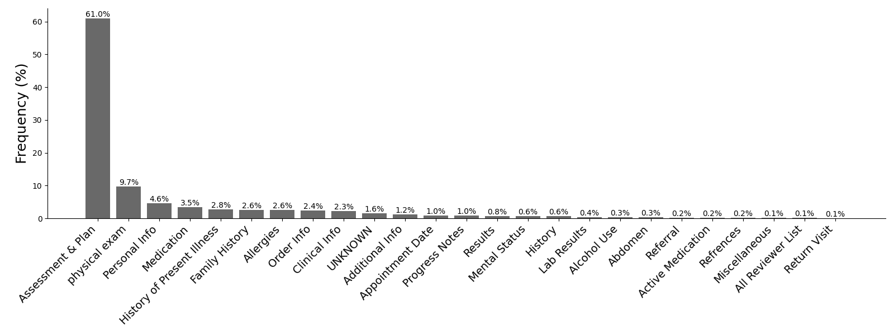

# 基于大型语言模型的章节识别器在开源项目中表现优异，然而一旦应用于现实世界场景，却显得力不从心。

发布时间：2024年04月24日

`LLM应用` `机器学习`

> LLM-Based Section Identifiers Excel on Open Source but Stumble in Real World Applications

# 摘要

> 电子健康档案（EHR）为医疗从业者带来了便利，但它们日益变得冗长且复杂。在这些庞大的数据中寻找关键信息不仅耗时，也成为医患交流中的一个负担。尽管已提出多种解决方案，如摘要化或分节，但真正有效的办法并不多。随着自动化技术的兴起，机器学习（ML）在识别EHR中的关键部分方面展现出潜力。不过，大多数ML技术都需要标注数据，这在医疗领域难以获得。与此同时，大型语言模型（LLMs）在自然语言处理（NLP）领域取得了显著成果，即便是在没有标注数据的零样本学习（zero-shot learning）情境下。基于此，我们提出利用LLMs来识别EHR中的关键段落标题。我们的研究显示，GPT-4在零样本和少样本的场景下都能高效完成任务，并且在数据分段上超越了现有的顶尖方法。此外，我们还对一个更具挑战性的现实世界数据集进行了标注，发现GPT-4在处理上仍有挑战，这提示了未来研究的方向和对更高难度基准的需求。

> Electronic health records (EHR) even though a boon for healthcare practitioners, are growing convoluted and longer every day. Sifting around these lengthy EHRs is taxing and becomes a cumbersome part of physician-patient interaction. Several approaches have been proposed to help alleviate this prevalent issue either via summarization or sectioning, however, only a few approaches have truly been helpful in the past. With the rise of automated methods, machine learning (ML) has shown promise in solving the task of identifying relevant sections in EHR. However, most ML methods rely on labeled data which is difficult to get in healthcare. Large language models (LLMs) on the other hand, have performed impressive feats in natural language processing (NLP), that too in a zero-shot manner, i.e. without any labeled data. To that end, we propose using LLMs to identify relevant section headers. We find that GPT-4 can effectively solve the task on both zero and few-shot settings as well as segment dramatically better than state-of-the-art methods. Additionally, we also annotate a much harder real world dataset and find that GPT-4 struggles to perform well, alluding to further research and harder benchmarks.

[Arxiv](https://arxiv.org/abs/2404.16294)