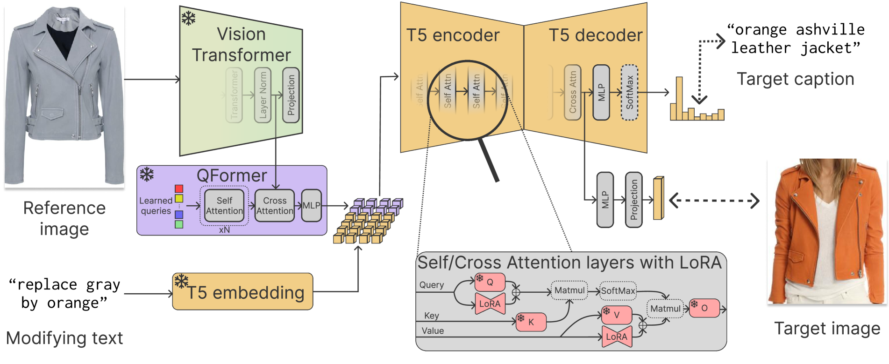
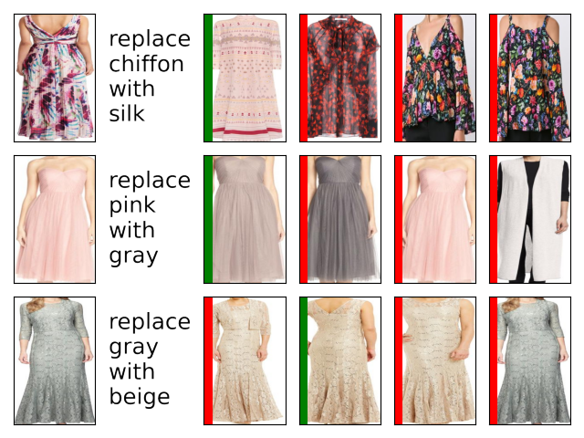

# 通过大型语言模型实现多模态搜索的潜力挖掘。

发布时间：2024年04月24日

`LLM应用` `电子商务` `搜索技术`

> Leveraging Large Language Models for Multimodal Search

# 摘要

> 多模态搜索正日益成为用户表达搜索意图的自然而有效手段。图片能展示产品细节，文本便于搜索调整。但现有多模态搜索系统在处理简单查询时表现不稳定，且面对多样化的自然语言查询，这些查询可能含糊、隐晦或包含无关内容，系统面临更大挑战。要解决这些问题，系统需具备更强大的匹配、推理能力和能够感知上下文的查询解析及重写功能。本文提出的新型多模态搜索模型在Fashion200K数据集上创下了新的性能记录。我们还设计了一种新颖的搜索界面，整合了大型语言模型（LLMs），以便更自然地与用户互动。该界面在与用户对话的同时，会考虑用户之前的搜索记录，并将查询引导至搜索系统。结合我们的多模态搜索模型，它预示着购物助手将迈入一个新时代，能够提供更人性化的互动和更优的搜索体验。

> Multimodal search has become increasingly important in providing users with a natural and effective way to ex-press their search intentions. Images offer fine-grained details of the desired products, while text allows for easily incorporating search modifications. However, some existing multimodal search systems are unreliable and fail to address simple queries. The problem becomes harder with the large variability of natural language text queries, which may contain ambiguous, implicit, and irrelevant in-formation. Addressing these issues may require systems with enhanced matching capabilities, reasoning abilities, and context-aware query parsing and rewriting. This paper introduces a novel multimodal search model that achieves a new performance milestone on the Fashion200K dataset. Additionally, we propose a novel search interface integrating Large Language Models (LLMs) to facilitate natural language interaction. This interface routes queries to search systems while conversationally engaging with users and considering previous searches. When coupled with our multimodal search model, it heralds a new era of shopping assistants capable of offering human-like interaction and enhancing the overall search experience.

[Arxiv](https://arxiv.org/abs/2404.15790)