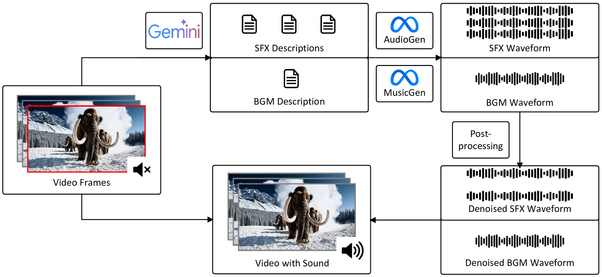
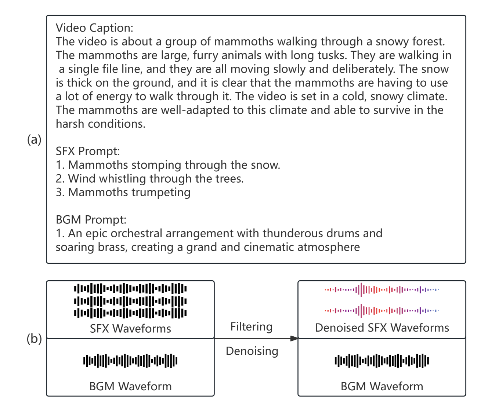

# 利用多模态大型语言模型，实现视频到音频的语义一致性生成。

发布时间：2024年04月24日

`LLM应用` `视频制作` `音频生成`

> Semantically consistent Video-to-Audio Generation using Multimodal Language Large Model

# 摘要

> 尽管现有研究在视频生成技术上取得了突破，但缺少音效和背景音乐使得观众无法获得完全沉浸式的体验。为此，我们提出了一个创新的视频到音频生成框架——SVA，它能够自动生成与视频内容语义相匹配的音频。SVA框架利用多模态大型语言模型深入理解关键帧的语义，并据此设计出创新的音频方案，这些方案随后作为文本到音频模型的输入，实现了以自然语言为媒介的视频到音频的生成。通过案例分析，我们证明了SVA的卓越性能，并对其局限性及未来研究的方向进行了探讨。项目详情可访问 https://huiz-a.github.io/audio4video.github.io/。

> Existing works have made strides in video generation, but the lack of sound effects (SFX) and background music (BGM) hinders a complete and immersive viewer experience. We introduce a novel semantically consistent v ideo-to-audio generation framework, namely SVA, which automatically generates audio semantically consistent with the given video content. The framework harnesses the power of multimodal large language model (MLLM) to understand video semantics from a key frame and generate creative audio schemes, which are then utilized as prompts for text-to-audio models, resulting in video-to-audio generation with natural language as an interface. We show the satisfactory performance of SVA through case study and discuss the limitations along with the future research direction. The project page is available at https://huiz-a.github.io/audio4video.github.io/.

[Arxiv](https://arxiv.org/abs/2404.16305)