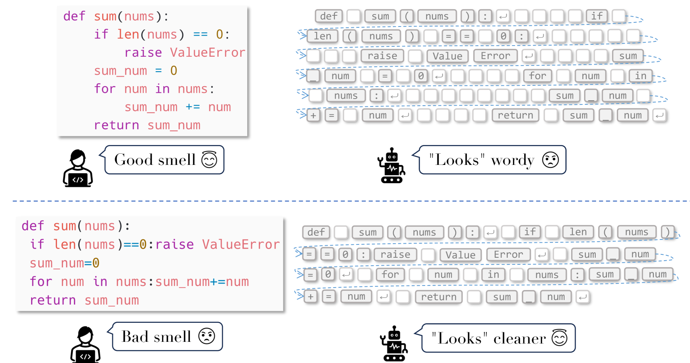
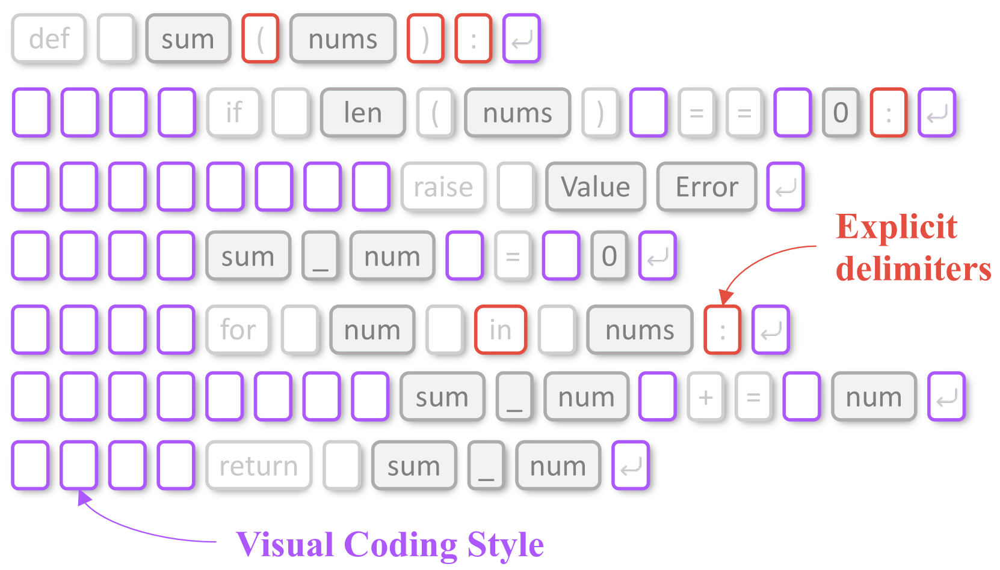
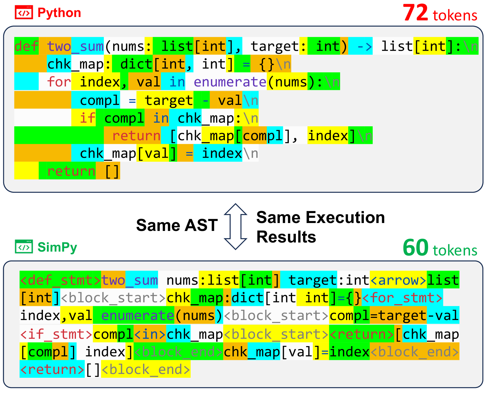
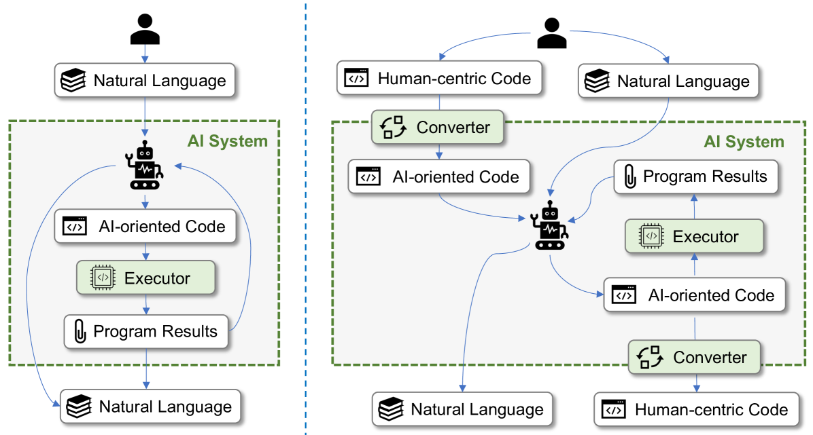

# AI 编码器悄然兴起：我们正重新审视编程语言的语法规则，以期达到更高效的代码生成。

发布时间：2024年04月25日

`LLM应用` `编程语言` `人工智能`

> AI Coders Are Among Us: Rethinking Programming Language Grammar Towards Efficient Code Generation

# 摘要

> 随着我们步入大型语言模型（LLMs）的时代，人工智能（AI）模型已跃升为编程语言的关键用户之一。这些模型不仅能在编程竞赛中大放异彩，还能像专业开发者一样编写代码，处理包括数学计算在内的多样化任务。但现有的程序设计，无论是语法还是格式，都是以人类阅读为考量。这种设计虽然方便了人类，却给 LLMs 带来了额外的计算负担。为了提升推理效率并减少成本，我们提出了一种新的面向 AI 的语法概念，它以更适合 AI 模型工作方式的形式来表示代码。我们探索并实现了首个面向 AI 的 Python 语法——Simple Python（SimPy），它通过一系列启发式规则对传统 Python 语法进行了精简，去除了不必要的格式，用最少量的标记高效传递代码含义。SimPy 编写的程序与标准 Python 保持相同的抽象语法树（AST）结构，可以通过修改后的 AST 解析器执行。我们还研究了如何让现有的 LLMs 熟练掌握并使用 SimPy，同时确保这些改动对人类开发者无影响。相较于传统 Python，SimPy 在 CodeLlama 和 GPT-4 上分别减少了 13.5% 和 10.4% 的标记使用，并且能够实现与 Python 代码训练的模型相匹敌，甚至更优的性能。

> Besides humans and machines, Artificial Intelligence (AI) models have emerged to be another important audience of programming languages, as we come to the era of large language models (LLMs). LLMs can now excel at coding competitions and even program like developers to address various tasks, such as math calculation. Yet, the grammar and layout of existing programs are designed for humans. Particularly, abundant grammar tokens and formatting tokens are included to make the code more readable to humans. While beneficial, such a human-centric design imposes an unnecessary computational burden on LLMs where each token, either consumed or generated, consumes computational resources. To improve inference efficiency and reduce computational costs, we propose the concept of AI-oriented grammar, which aims to represent the code in a way that better suits the working mechanism of AI models. Code written with AI-oriented grammar discards formats and uses a minimum number of tokens to convey code semantics effectively. To demonstrate the feasibility of this concept, we explore and implement the first AI-oriented grammar for Python, named Simple Python (SimPy). SimPy is crafted by revising the original Python grammar through a series of heuristic rules. Programs written in SimPy maintain identical Abstract Syntax Tree (AST) structures to those in standard Python, allowing execution via a modified AST parser. In addition, we explore methods to enable existing LLMs to proficiently understand and use SimPy, and ensure the changes remain imperceptible for human developers. Compared with the original Python, SimPy not only reduces token usage by 13.5% and 10.4% for CodeLlama and GPT-4, but can also achieve equivalent, even improved, performance over the models trained on Python code.

[Arxiv](https://arxiv.org/abs/2404.16333)