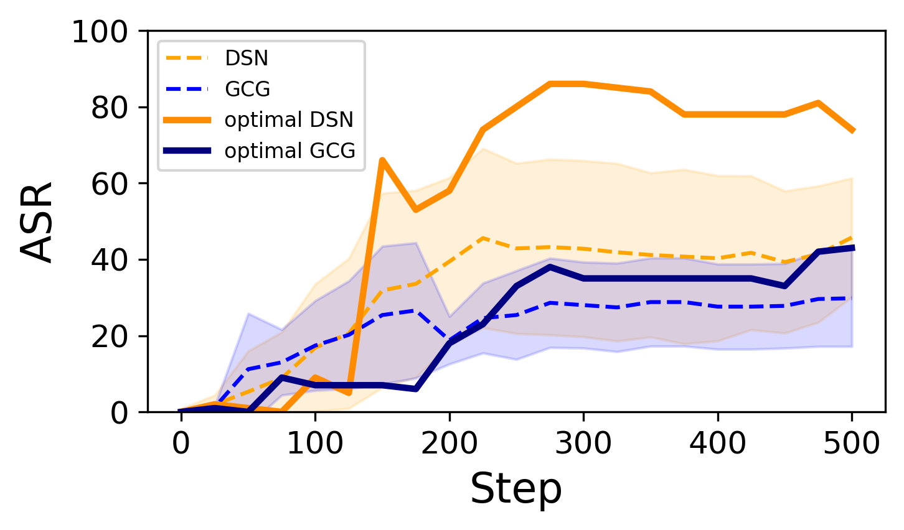
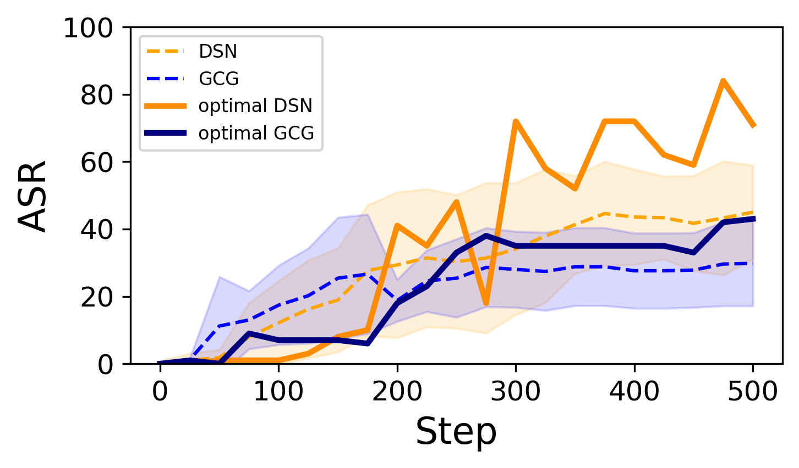
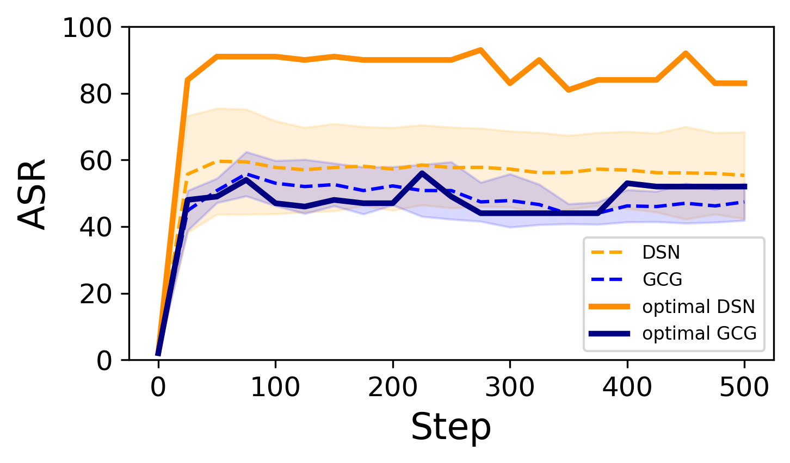
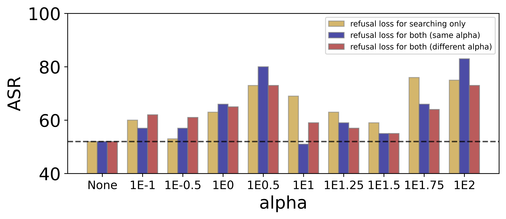
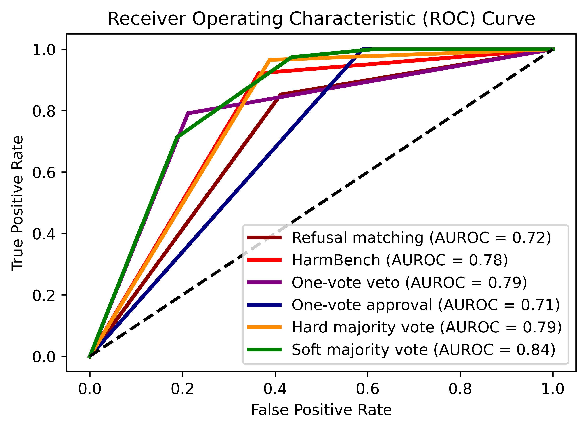
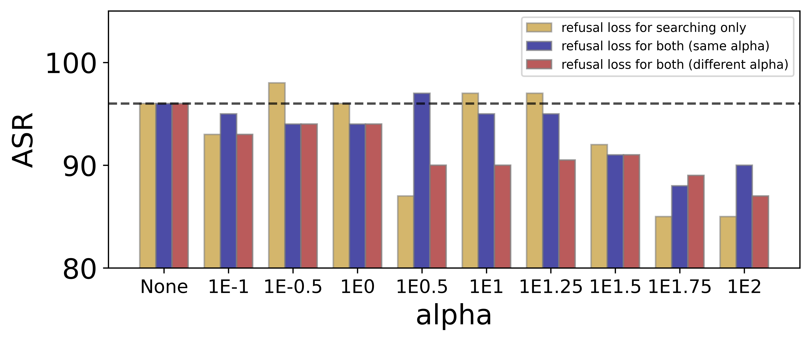

# 莫言拒绝：抑制拒绝行为以解锁大型语言模型的潜能

发布时间：2024年04月25日

`LLM应用` `人工智能`

> Don't Say No: Jailbreaking LLM by Suppressing Refusal

# 摘要

> 保障大型语言模型（LLMs）的安全一致性对于产生符合人类价值观的回应极为关键。尽管LLMs能够识别并规避有害的查询，但它们仍易受到“越狱”攻击的威胁，这类攻击通过精心构造的提示诱使模型生成有害内容。在这些越狱攻击中，一种常见的方式是将任务转化为对抗性攻击，诱使LLMs作出肯定回答。然而，这类攻击中的典型手段——GCG攻击——其成功率并不高。本研究旨在深入探究越狱攻击，特此引入了DSN（不要说不）攻击，它不仅诱导LLMs生成肯定回应，还创新性地增加了抑制拒绝的目标。此外，越狱攻击的评估工作同样充满挑战，因为直接且精确地衡量攻击的有害程度颇为困难。目前使用的评估方法，例如拒绝关键词匹配，存在局限，因为它会产生大量误报和漏报。为了应对这一挑战，我们提出了一种集成评估流程，该流程结合了自然语言推理（NLI）的矛盾评估以及两个外部LLM评估器。广泛的实验验证了DSN攻击的强大效力以及集成评估方法相比传统基线方法的有效性。

> Ensuring the safety alignment of Large Language Models (LLMs) is crucial to generating responses consistent with human values. Despite their ability to recognize and avoid harmful queries, LLMs are vulnerable to "jailbreaking" attacks, where carefully crafted prompts elicit them to produce toxic content. One category of jailbreak attacks is reformulating the task as adversarial attacks by eliciting the LLM to generate an affirmative response. However, the typical attack in this category GCG has very limited attack success rate. In this study, to better study the jailbreak attack, we introduce the DSN (Don't Say No) attack, which prompts LLMs to not only generate affirmative responses but also novelly enhance the objective to suppress refusals. In addition, another challenge lies in jailbreak attacks is the evaluation, as it is difficult to directly and accurately assess the harmfulness of the attack. The existing evaluation such as refusal keyword matching has its own limitation as it reveals numerous false positive and false negative instances. To overcome this challenge, we propose an ensemble evaluation pipeline incorporating Natural Language Inference (NLI) contradiction assessment and two external LLM evaluators. Extensive experiments demonstrate the potency of the DSN and the effectiveness of ensemble evaluation compared to baseline methods.

[Arxiv](https://arxiv.org/abs/2404.16369)