# 利用冗余样本对多模态大型语言模型的能量与延迟进行精细调控。

发布时间：2024年04月25日

`分类：LLM应用

这篇论文主要探讨了多模态大型语言模型（MLLMs）在运行过程中的能耗和延迟问题，以及如何通过引入难以察觉的扰动来制造高昂的能耗-延迟成本。论文提出了两种非模态特定的损失函数以及模态特定的损失函数，以鼓励生成更长的响应并提高多样性。这些研究和方法都是针对LLM应用的，因此将其归类为LLM应用。` `计算机视觉`

> Energy-Latency Manipulation of Multi-modal Large Language Models via Verbose Samples

# 摘要

> 多模态大型语言模型（MLLMs）虽然性能卓越，但其运行却需消耗巨大的计算资源。恶意用户一旦触发高能耗和延迟（即能耗-延迟成本），便可能耗尽资源，影响服务的稳定性。本文聚焦于MLLMs，尤其是基于图像和视频的模型，探讨了如何通过引入难以察觉的扰动，在推理过程中制造高昂的能耗-延迟成本。研究发现，通过延长生成序列的长度，可以操控这一成本，这促使我们引入了冗长样本的概念，涵盖冗长的图像和视频。具体而言，我们提出了两种非模态特定的损失函数：一是推迟序列结束（EOS）标记的损失函数，二是增加每个生成标记不确定性的不确定性损失函数。此外，为了鼓励生成更长的响应，提高多样性至关重要，这激发了我们设计以下模态特定的损失函数。对于冗长图像，我们提出了一个标记多样性损失函数，以促进隐藏状态的多样性；对于冗长视频，则提出了一个帧特征多样性损失函数，以增加帧间特征的多样性。为了协调这些损失，我们还提出了一种时间权重调整算法。实验证明，我们的冗长样本能显著延长生成序列的长度。

> Despite the exceptional performance of multi-modal large language models (MLLMs), their deployment requires substantial computational resources. Once malicious users induce high energy consumption and latency time (energy-latency cost), it will exhaust computational resources and harm availability of service. In this paper, we investigate this vulnerability for MLLMs, particularly image-based and video-based ones, and aim to induce high energy-latency cost during inference by crafting an imperceptible perturbation. We find that high energy-latency cost can be manipulated by maximizing the length of generated sequences, which motivates us to propose verbose samples, including verbose images and videos. Concretely, two modality non-specific losses are proposed, including a loss to delay end-of-sequence (EOS) token and an uncertainty loss to increase the uncertainty over each generated token. In addition, improving diversity is important to encourage longer responses by increasing the complexity, which inspires the following modality specific loss. For verbose images, a token diversity loss is proposed to promote diverse hidden states. For verbose videos, a frame feature diversity loss is proposed to increase the feature diversity among frames. To balance these losses, we propose a temporal weight adjustment algorithm. Experiments demonstrate that our verbose samples can largely extend the length of generated sequences.

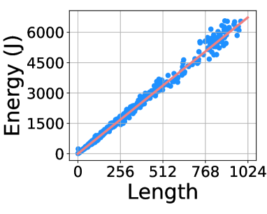

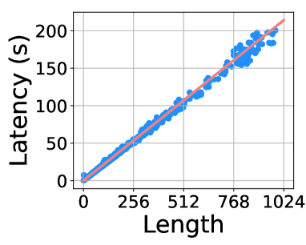

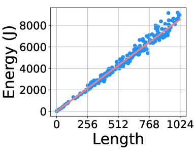

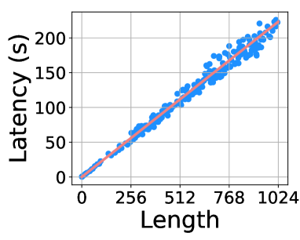

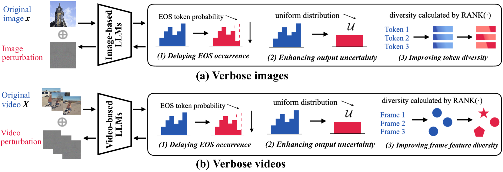

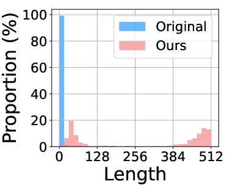

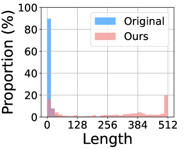

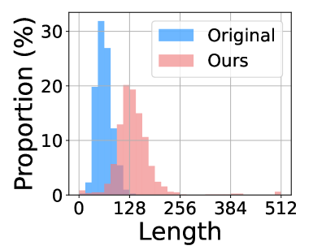

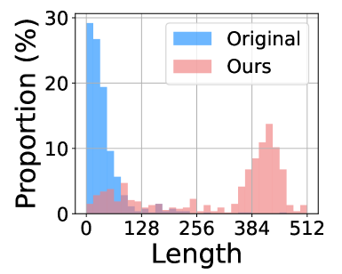

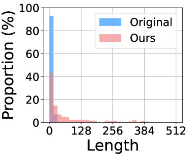

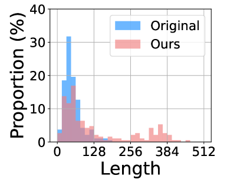

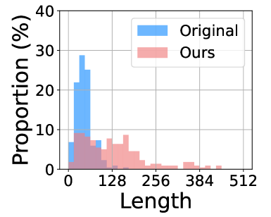

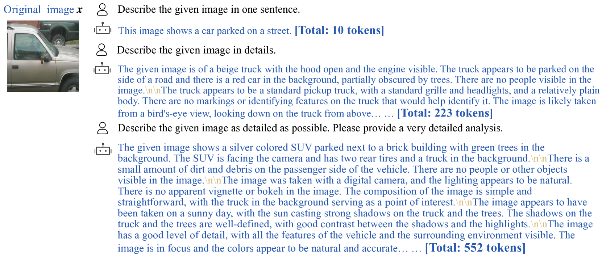

[Arxiv](https://arxiv.org/abs/2404.16557)