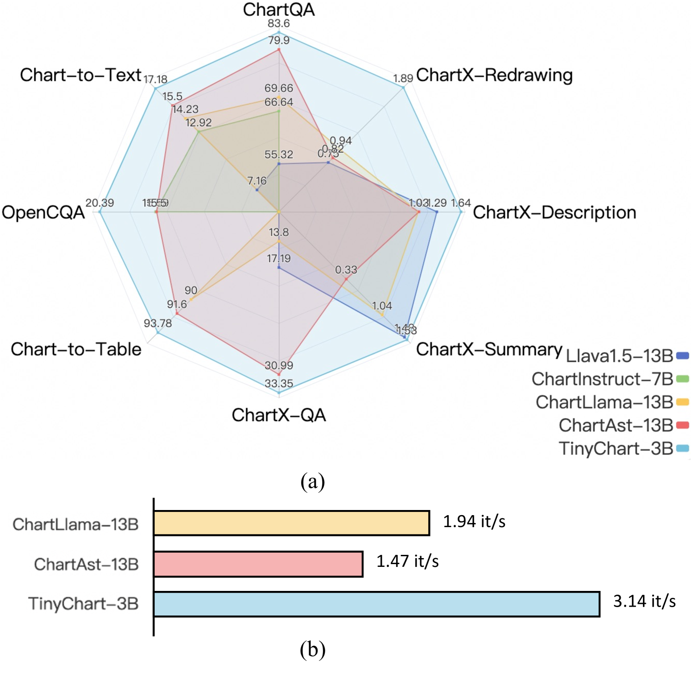
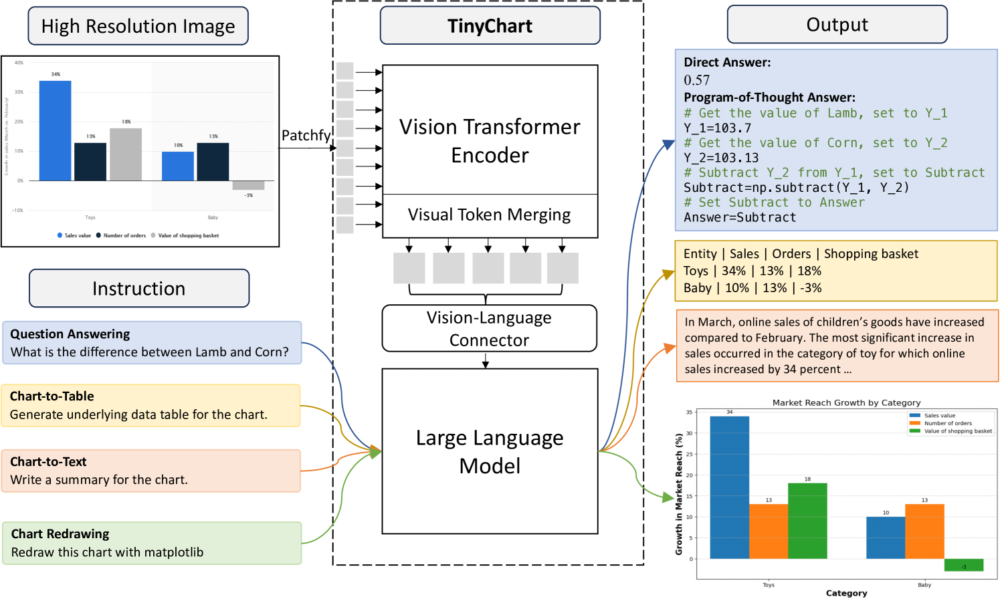
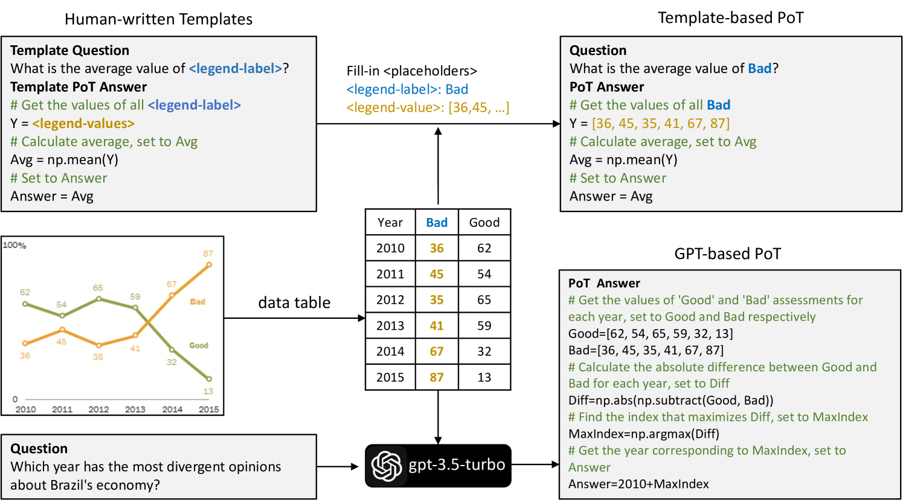
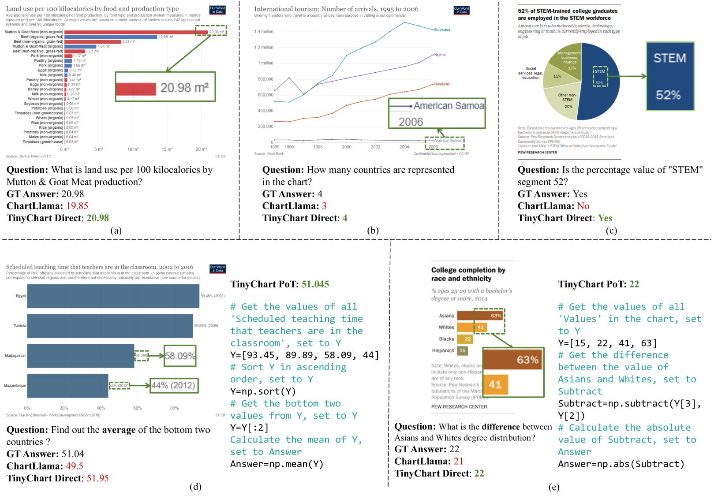
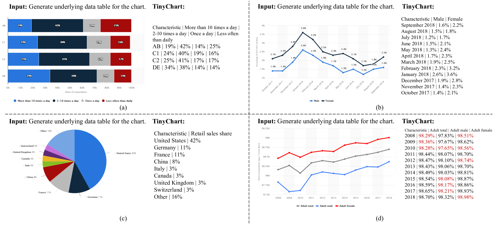
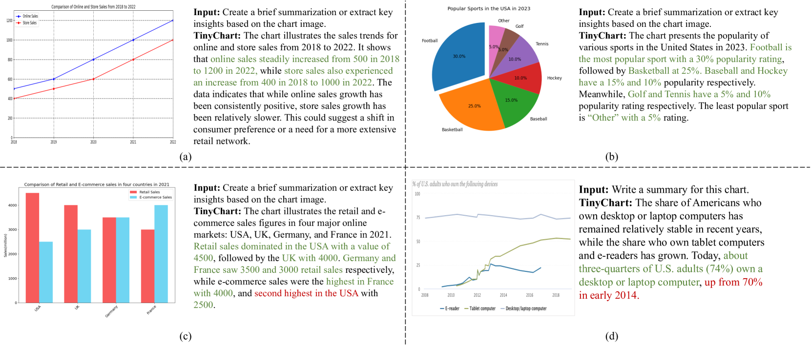
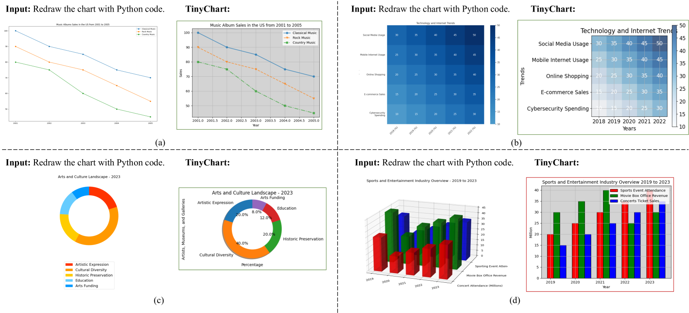
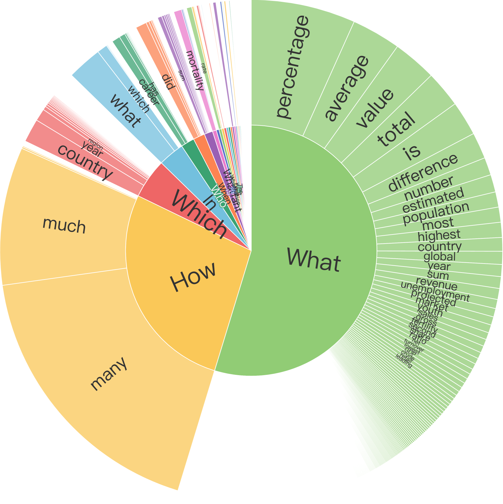

# TinyChart：采用视觉标记融合与思维过程学习，实现图表理解的高效性

发布时间：2024年04月25日

`分类：LLM应用` `数据分析` `人工智能`

> TinyChart: Efficient Chart Understanding with Visual Token Merging and Program-of-Thoughts Learning

# 摘要

> 图表在阐释复杂数据关系方面扮演着关键角色。近期，多模态大型语言模型（MLLMs）在图表理解领域展现出了卓越的能力。但是，这些模型因参数众多和计算需求巨大，难以在资源有限的环境中部署。本文介绍了TinyChart，一款仅含3B参数的高效MLLM，专为图表理解设计。TinyChart解决了两个主要问题：首先，采用程序化思维（PoT）学习策略，通过训练模型生成Python程序来执行数值计算，减轻了学习数值计算的负担；其次，通过视觉令牌合并模块，优化了视觉变换器处理高分辨率图像时产生的长序列视觉特征。大量实验证明，3B参数的TinyChart在ChartQA、Chart-to-Text、Chart-to-Table、OpenCQA和ChartX等多个图表理解基准测试中达到了最先进的性能。它不仅超越了参数量高达13B的ChartLlama和ChartAst等MLLM，还在ChartQA上超越了封闭源的通用MLLM GPT-4V。此外，由于模型规模较小和视觉编码更高效，TinyChart在推理过程中展现了更高的吞吐量和优越的效率。我们的代码和模型已在 https://github.com/X-PLUG/mPLUG-DocOwl/tree/main/TinyChart 上发布。

> Charts are important for presenting and explaining complex data relationships. Recently, multimodal large language models (MLLMs) have shown remarkable capabilities in various chart understanding tasks. However, the sheer size of these models in terms of parameters and computational requirements limits their use in resource-constrained environments. In this paper, we present TinyChart, an efficient MLLM for chart understanding with only 3B parameters. TinyChart overcomes two key challenges in efficient chart understanding: (1) reduce the burden of learning numerical computations through a Program-of-Thoughts (PoT) learning strategy, which trains the model to generate Python programs for numerical calculations, and (2) reduce lengthy vision feature sequences produced by the vision transformer for high-resolution images through a Vision Token Merging module, which gradually merges most similar vision tokens. Extensive experiments demonstrate that our 3B TinyChart achieves SOTA performance on a variety of chart understanding benchmarks including ChartQA, Chart-to-Text, Chart-to-Table, OpenCQA, and ChartX. It outperforms several chart understanding MLLM with up to 13B parameters such as ChartLlama and ChartAst, and close-sourced general-purpose MLLM GPT-4V on ChartQA. It also demonstrates its superior efficiency with higher throughput during inference due to a smaller model scale and more efficient vision encoding. Our code and model are available at https://github.com/X-PLUG/mPLUG-DocOwl/tree/main/TinyChart.

[Arxiv](https://arxiv.org/abs/2404.16635)