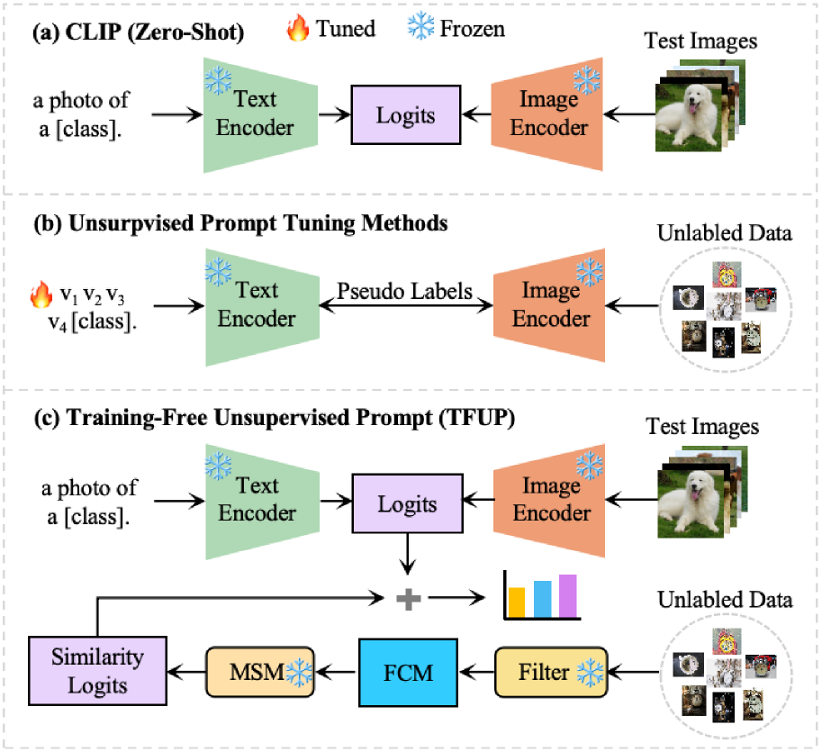

# 为视觉-语言模型提供一种无需训练的无监督引导方式。

发布时间：2024年04月25日

`分类：LLM应用` `计算机视觉` `机器学习`

> Training-Free Unsupervised Prompt for Vision-Language Models

# 摘要

> 提示学习已成为调整大型预训练视觉-语言模型以适应下游任务的高效方式。最近，诸如UPL和POUF这样的无监督提示调整技术，通过伪标签提供监督信息，以微调未标记数据上的额外适应模块。但伪标签的不准确性可能会误导微调过程，影响模型的表现力。为此，我们引入了一种无需训练的无监督提示方法（TFUP），它在无需训练和标记的情况下，通过残差连接增强了模型的固有表示能力，并利用基于相似性的预测概率。我们综合考虑了实例置信度和原型得分，以挑选出代表性的样本，这些样本用于定制一个可靠的特征缓存模型（FCM），进行无需训练的推理。此外，我们开发了一种多级相似性度量（MSM），它同时考虑了特征和语义层面的相似性，以计算测试图像与缓存样本之间的距离，作为生成基于相似性预测概率的权重。这种方法使得TFUP在多个分类数据集上的表现甚至超过了基于训练的方法。基于TFUP，我们还提出了一种基于训练的方法（TFUP-T），通过引入边缘分布熵损失，从全局视角优化模型，进一步提升了适应性能。在多个基准测试中，TFUP-T在无监督和少样本适应方法中取得了最佳的分类性能，特别是在最具挑战性的Domain-Net数据集上，将POUF的分类准确率提升了3.3%。

> Prompt learning has become the most effective paradigm for adapting large pre-trained vision-language models (VLMs) to downstream tasks. Recently, unsupervised prompt tuning methods, such as UPL and POUF, directly leverage pseudo-labels as supervisory information to fine-tune additional adaptation modules on unlabeled data. However, inaccurate pseudo labels easily misguide the tuning process and result in poor representation capabilities. In light of this, we propose Training-Free Unsupervised Prompts (TFUP), which maximally preserves the inherent representation capabilities and enhances them with a residual connection to similarity-based prediction probabilities in a training-free and labeling-free manner. Specifically, we integrate both instance confidence and prototype scores to select representative samples, which are used to customize a reliable Feature Cache Model (FCM) for training-free inference. Then, we design a Multi-level Similarity Measure (MSM) that considers both feature-level and semantic-level similarities to calculate the distance between each test image and the cached sample as the weight of the corresponding cached label to generate similarity-based prediction probabilities. In this way, TFUP achieves surprising performance, even surpassing the training-base method on multiple classification datasets. Based on our TFUP, we propose a training-based approach (TFUP-T) to further boost the adaptation performance. In addition to the standard cross-entropy loss, TFUP-T adopts an additional marginal distribution entropy loss to constrain the model from a global perspective. Our TFUP-T achieves new state-of-the-art classification performance compared to unsupervised and few-shot adaptation approaches on multiple benchmarks. In particular, TFUP-T improves the classification accuracy of POUF by 3.3% on the most challenging Domain-Net dataset.

[Arxiv](https://arxiv.org/abs/2404.16339)