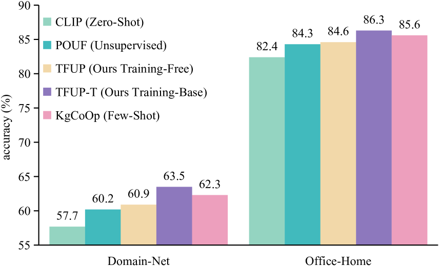
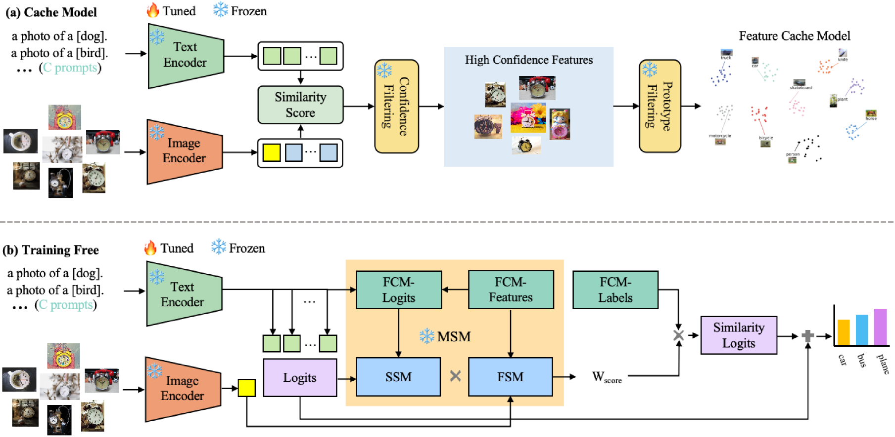
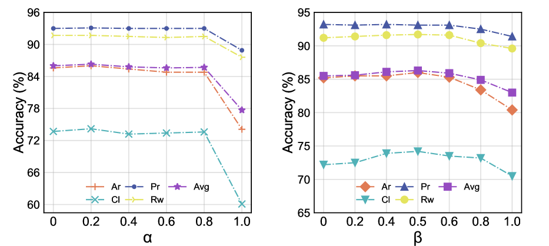

# 免训练的无监督提示技术，为视觉-语言模型注入新活力。

发布时间：2024年04月25日

`LLM应用` `计算机视觉` `机器学习`

> Training-Free Unsupervised Prompt for Vision-Language Models

# 摘要

> 提示学习已成为适配大型预训练视觉-语言模型至下游任务的高效策略。新兴的无监督提示调整技术，例如UPL和POUF，通过伪标签提供监督信息，以微调未标记数据上的额外适配模块。但伪标签的不精确性常导致调整过程误入歧途，影响模型的表现力。为此，我们引入了一种免训练的无监督提示方法（TFUP），它在无需训练和标注的情况下，通过残差连接增强模型的内在表示能力，并与基于相似性的预测概率相结合。具体而言，我们融合实例置信度和原型分数来筛选具有代表性的样本，并利用这些样本定制一个可靠的特征缓存模型（FCM），以实现免训练的推理。此外，我们构建了一个多级相似性度量（MSM），综合考量特征层面和语义层面的相似度，以计算测试图像与缓存样本间的距离，并将此距离作为相应缓存标签权重，用以生成基于相似性的预测概率。这一方法使TFUP在多个分类数据集上取得了突破性的成绩，甚至超过了基于训练的方法。基于TFUP，我们进一步提出了一种基于训练的方法（TFUP-T），通过引入边际分布熵损失，从宏观角度对模型进行约束，以提升适配性能。TFUP-T在多个基准测试中刷新了无监督和少样本适应方法的分类性能记录，特别是在难度最高的Domain-Net数据集上，将POUF的分类准确率提升了3.3%。

> Prompt learning has become the most effective paradigm for adapting large pre-trained vision-language models (VLMs) to downstream tasks. Recently, unsupervised prompt tuning methods, such as UPL and POUF, directly leverage pseudo-labels as supervisory information to fine-tune additional adaptation modules on unlabeled data. However, inaccurate pseudo labels easily misguide the tuning process and result in poor representation capabilities. In light of this, we propose Training-Free Unsupervised Prompts (TFUP), which maximally preserves the inherent representation capabilities and enhances them with a residual connection to similarity-based prediction probabilities in a training-free and labeling-free manner. Specifically, we integrate both instance confidence and prototype scores to select representative samples, which are used to customize a reliable Feature Cache Model (FCM) for training-free inference. Then, we design a Multi-level Similarity Measure (MSM) that considers both feature-level and semantic-level similarities to calculate the distance between each test image and the cached sample as the weight of the corresponding cached label to generate similarity-based prediction probabilities. In this way, TFUP achieves surprising performance, even surpassing the training-base method on multiple classification datasets. Based on our TFUP, we propose a training-based approach (TFUP-T) to further boost the adaptation performance. In addition to the standard cross-entropy loss, TFUP-T adopts an additional marginal distribution entropy loss to constrain the model from a global perspective. Our TFUP-T achieves new state-of-the-art classification performance compared to unsupervised and few-shot adaptation approaches on multiple benchmarks. In particular, TFUP-T improves the classification accuracy of POUF by 3.3% on the most challenging Domain-Net dataset.

[Arxiv](https://arxiv.org/abs/2404.16339)