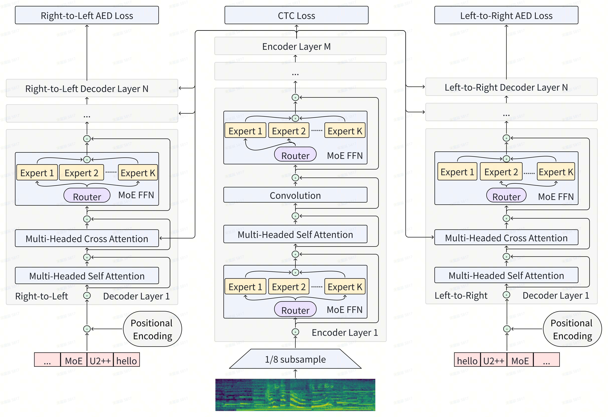

# U2++ MoE：在几乎不影响实时性能的情况下，实现了参数量的4.7倍扩展。

发布时间：2024年04月25日

`LLM理论` `自动语音识别`

> U2++ MoE: Scaling 4.7x parameters with minimal impact on RTF

# 摘要

> 规模的扩大为自然语言处理领域带来了新的突破，但这背后是高昂的成本。为了解决这一问题，专家混合（MoE）模型应运而生，它通过在训练和推理过程中仅激活部分参数，为构建更大、更高效的语言模型提供了一条节能之路。这一新兴的模型架构正逐渐在自动语音识别（ASR）领域获得关注。近期的研究尝试将MoE融入ASR模型，采用了诸如通过辅助嵌入网络路由帧、提升专家的多语言处理能力，以及利用专门的辅助损失来平衡专家负载或处理特定语言等复杂设计。然而，我们发现这些复杂的设计并非必需，简单地用MoE层替换所有前馈网络（FFN）层就足以胜任ASR任务。具体而言，我们在大规模内部数据集（160,000小时）上对提出的模型进行了基准测试，结果表明，我们可以将基线Conformer模型（Dense-225M）扩展至MoE版本（MoE-1B），在保持Dense-225M级别的实时因子（RTF）的同时，达到Dense-1B级别的词错误率（WER）。此外，通过引入统一的双向注意力解码器两遍框架（U2++），我们在基于MoE的单一模型中实现了流式和非流式的解码模式，即U2++ MoE模型。我们期望本研究能够推动在不牺牲部署效率的前提下，对语音基础模型进行扩展的研究。

> Scale has opened new frontiers in natural language processing, but at a high cost. In response, by learning to only activate a subset of parameters in training and inference, Mixture-of-Experts (MoE) have been proposed as an energy efficient path to even larger and more capable language models and this shift towards a new generation of foundation models is gaining momentum, particularly within the field of Automatic Speech Recognition (ASR). Recent works that incorporating MoE into ASR models have complex designs such as routing frames via supplementary embedding network, improving multilingual ability for the experts, and utilizing dedicated auxiliary losses for either expert load balancing or specific language handling. We found that delicate designs are not necessary, while an embarrassingly simple substitution of MoE layers for all Feed-Forward Network (FFN) layers is competent for the ASR task. To be more specific, we benchmark our proposed model on a large scale inner-source dataset (160k hours), the results show that we can scale our baseline Conformer (Dense-225M) to its MoE counterparts (MoE-1B) and achieve Dense-1B level Word Error Rate (WER) while maintaining a Dense-225M level Real Time Factor (RTF). Furthermore, by applying Unified 2-pass framework with bidirectional attention decoders (U2++), we achieve the streaming and non-streaming decoding modes in a single MoE based model, which we call U2++ MoE. We hope that our study can facilitate the research on scaling speech foundation models without sacrificing deployment efficiency.

[Arxiv](https://arxiv.org/abs/2404.16407)